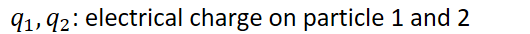

# Atomic Structure and Electron Configuration
-   Atoms have a positively charged nucleus (protons, neutrons) surrounded by negatively charged electrons
-   **Coulomb's Law:**

    -   Used to calculate the force between two charged particles

    -   {width="1.7291666666666667in" height="0.5833333333333334in"}

        -   {width="5.520833333333333in" height="0.3541666666666667in"}

        -   {width="3.9895833333333335in" height="0.3541666666666667in"}

    -   Force is negative: attraction

    -   Force is positive: repulsion

    -   Larger magnitude of forces => more attraction (directly proportional)

    -   Larger distance (r) => less attraction (inversely proportional to square)
-   Application

    -   Larger atoms (more protons) will hold onto their electrons more tightly

        -   Given they are the same distance away (compare 1s and 1s for example)

    -   Takes less energy to remove electrons farther from the nucleus

    -   Attractive force determines ionization energy (how much energy it takes to remove electrons)

    -   **Electron shielding is less important than distance between charged bodies**

