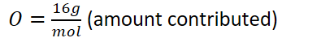
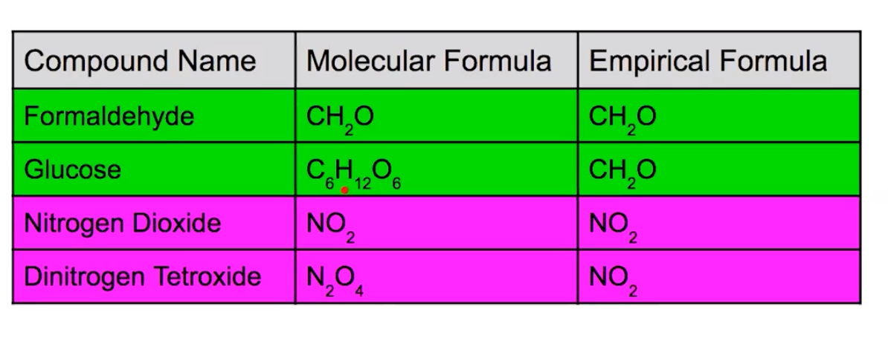
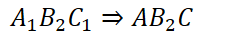

# Elemental composition of pure substances
-   All **pure substances** have a **fixed composition**

    -   Elements present and the ratio of these elements is the same for **every sample** of the compound

    -   Example: NaCl: 1:1 ratio of Na and Cl, ALWAYS
-   This means that the mass ratio between the elements is the same:

    -   NaCl will ALWAYS be 39.3% Na and 60.7% Cl by mass
-   To find percent composition of a particular element:

    -   Find total molar mass of the substance

    -   Find the amount contributed by the specific element

    -   Amount contributed / molar mass

    -   {width="2.2604166666666665in" height="0.3541666666666667in"}

        -   {width="3.6145833333333335in" height="0.3541666666666667in"}

            -   {width="2.0104166666666665in" height="0.65625in"}

            -   {width="4.114583333333333in" height="0.4895833333333333in"}

            -   {width="2.6041666666666665in" height="0.6458333333333334in"}

            -   {width="4.65625in" height="0.3541666666666667in"}

                -   89% Oxygen

                -   11%/ Hydrogen
-   Different substances can have the same percent composition:

    -   {width="3.4166666666666665in" height="0.3541666666666667in"}

        -   Same ratio of nitrogen to oxygen: 1:2

        -   Therefore, will have same percent composition
-   The **lowest whole number ratio** of atoms of each element is its **empirical formula**

    -   {width="6.583333333333333in" height="0.3541666666666667in"}
-   The actual number of atoms of each element in a compound is its chemical (molecular) formula

    -   {width="3.90625in" height="0.3541666666666667in"}

{width="6.03125in" height="2.2916666666666665in"}
-   To get an empirical formula from obtained data:

    -   If given masses of elements (or percent masses):

    -   Convert masses to moles

    -   Divide by the lowest whole number of moles

        -   {width="8.208333333333334in" height="0.6770833333333334in"}

    -   Using the given ratio write the formula:

        -   {width="2.5729166666666665in" height="0.3333333333333333in"}

