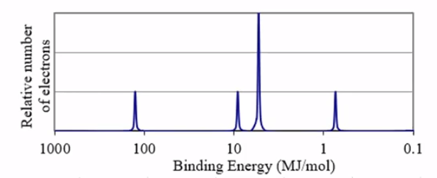

# Photoelectrons Spectroscopy
-   In atoms and ions, electrons exist in "energy levels" and the "subshells" within them

    -   1s^2^

        -   1 is the **energy level** (1, 2, 3, 4, ...)

        -   s is the **subshell** (s, p, d, f)

        -   2 is the quantity of electrons in the subshell (1, 2 for s, 1 to 6 for p, ...)
-   **Aufbau Principle:**

    -   Electrons will fill lower energy levels first then fill higher ones

{width="3.3645833333333335in" height="3.90625in"}
-   How to know the fill orders?

    -   Use **photoelectron spectroscopy**

```{=html}
<!-- -->
```
-   What is **Photoelectron Spectroscopy?**

    -   Determines the relative energies of electrons in atoms or ions

    -   Process:

        -   Radiation (high energy) is used removes electrons from an atom

            -   Radiation in **visible** or **ultraviolet** range for electron emission

            -   **Infrared radiation** to study chemical bonds

            -   **Microwave radiation** to study shapes of molecules

        -   Electrons are located in different energy levels and subshells

            -   Valence electrons (outermost shell) are easier to remove

            -   Core electrons (inner shells) are harder to remove

{width="6.395833333333333in" height="2.59375in"}
-   The height of the peak is the **relative amount of electrons** in the subshell

    -   Third peak from left has 3x the amount of electrons than second peak from left

```{=html}
<!-- -->
```
-   The x-position of the peak is the binding energy (energy required to remove the electrons)

    -   Left-most peak is usually the closest on to the nucleus

        -   Highest binding energy => closest
-   The number of electrons can be known by adding up all the peaks

    -   2 + 2 + 6 + 2 = 12 electrons

        -   Magnesium


