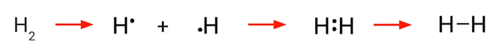
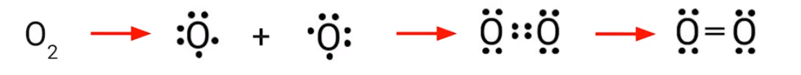
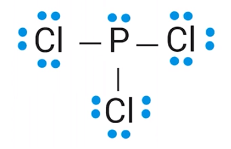
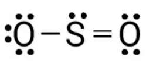

# Lewis Diagrams
-   How are molecules represented?

    -   Molecular formulas (H~2~O, etc)

    -   Lewis Diagrams: **graphical representation**
-   Lewis diagrams are models

    -   Represent chemical substances

    -   Show how the atoms connect

    -   Show the **bond order** (single bond, double bond) between atoms

    -   Shows **valence electrons** not participating in bonding
-   Example: Lewis diagram for water:

{width="2.2708333333333335in" height="1.21875in"}
-   H and O: Chemical symbols of hydrogen and oxygen
-   Lines: bonds between hydrogen and oxygen

    -   1 line = single bond, ...

        -   Represents a **pair** of shared electrons

        -   1 from hydrogen, 1 from oxygen

```{=html}
<!-- -->
```
-   Dots: valence electrons not participating in bonding

    -   Unshared

```{=html}
<!-- -->
```
-   Lewis diagrams can also be made for individual atoms:

    -   Dots are used to represent the number of valence electrons in an atom

    -   Show **only valence electrons**

        -   Max. 8 dots around an atom

    ```{=html}
    <!-- -->
    ```
    -   For nitrogen:

        -   {width="0.5520833333333334in" height="0.59375in"}

        -   5 valence electrons

```{=html}
<!-- -->
```
-   **An atom can only form as many bonds as it has valence electrons**

    -   Lithium can only form 1 covalent bond as it only has one valence electron to share, ...

    -   Carbon can form up to 4 covalent bonds

    -   **Only lone electrons can form bonds**

        -   Therefore, oxygen cannot form 6 bonds

        -   However, it can form two (2 missing electrons in outer shell => 2 lone electrons)
-   {width="6.333333333333333in" height="0.6354166666666666in"}

    -   Each hydrogen brings one electron, two electron => single bond
-   {width="6.34375in" height="0.59375in"}

    -   Each oxygen has two lone pairs, therefore a double bond forms as there are no other elements present to bond with

    -   How do we know a double bond is formed?

        -   The bond energy (energy a bond releases when it is formed) is much larger for oxygen (double bond) than for fluorine (single bond)
-   {width="5.78125in" height="0.6770833333333334in"}

    -   Nitrogen: three lone pairs, no other elements to bond with, so a triple bond is formed

    -   Bond energy of N~2~ is significantly larger than that of oxygen and fluorine
-   **The Octet Rule**

    -   Atoms will (usually) form covalent bonds so that they have **eight** electrons around them

        -   Carbon forms 4 bonds => eight electrons

        -   Nitrogen forms 3 bonds and has a pair => 3 * 2 = 6, + 2 in pair = 8

    -   However, there are some exceptions
-   **How to construct Lewis Diagrams: (example: PCl~3~)**

    -   Count the total number of valence electrons

        -   P has 5, Cl has 7, 5 + (7 * 3) = 26

    -   Determine the central atom

        -   Usually,

            -   Written first, or

            -   The "odd one out" (single atom with 2, 3, 4 others), or

            -   The least electronegative atom

        -   P is the central atom

    -   Place others around it and join with single bonds

        -   {width="2.3125in" height="1.3854166666666667in"}

    -   Calculate the number of electrons that are used by the single bonds

        -   3 single bonds, 3 * 2 = 6 electrons used

        -   Therefore, we have 26 - 6 = 20 electrons left over

    -   Add remaining electrons as electron pairs (dots) in the molecule

        -   Try to give each electron an octet (8) electrons

{width="2.6666666666666665in" height="1.71875in"}
-   If there are too little/too many electrons, the **central atom** either has extra or fewer electrons

```{=html}
<!-- -->
```
-   Form double or triple bonds if necessary

    -   Do this when the central atom does not have an octet

    -   {width="1.8125in" height="0.7604166666666666in"}

```{=html}
<!-- -->
```
-   Count all bonds and make sure there are the correct number of electrons

    -   3 single bonds = 3 * 2 = 6

    -   (3 * 6) + 2 free pairs = 20

    -   20 electrons in free pairs + 6 electrons in bonds = 26 electrons
-   For **ions (polyatomic):**

    -   {width="6.979166666666667in" height="0.3541666666666667in"}

    -   Example: NH~4~^+^ has 1 fewer electron available to construct the dot structure

    -   SO~4~^2-^ has 2 more electrons available to construct the dot structure

    -   **Put square brackets around the entire structure with the charge as superscript**

        -   {width="1.8020833333333333in" height="1.2708333333333333in"}

```{=html}
<!-- -->
```
-   When there are **extra** electrons and multi-bonds cannot be formed

    -   If the central atom is in **period 3** and above, it gets the extra electrons

        -   Example: XeF~4~

{width="1.9791666666666667in" height="1.6770833333333333in"}
-   Called an **extended octet**


