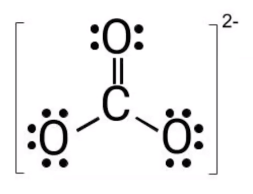
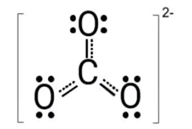

# Resonance
-   What happens when there are multiple places to put double bonds?

    -   A resonance structure is formed
-   {width="3.5625in" height="2.71875in"}

    -   There is not actually 1 shorter double bond and 2 longer single bonds

    -   All are the same length

    -   Because electrons are always in motion, the three bonds are the same length

        -   As if all bonds are 4/3 of a single bond
-   **Resonance:**

    -   If a molecule has more than one possible Lewis diagram, show them all

    -   The actual molecule is a superposition of all the structures

{width="6.28125in" height="1.5625in"}
-   An average of all three resonance structures

{width="2.1875in" height="1.46875in"}

-   {width="4.666666666666667in" height="1.4895833333333333in"}

    -   Resonance structure of the formate ion (HCO~2~)
-   **All resonance structures** must be shown?

    -   The resonating bond is **delocalized**

