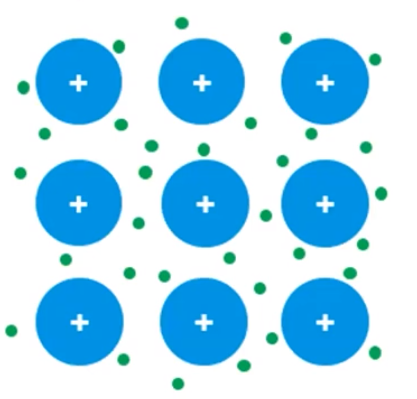

# Structure of Metals and Alloys
-   Metallic bonds:

    -   Positive metal ions surrounded by a "sea" of mobile valence electrons

        -   **Delocalized** electrons

{width="2.8854166666666665in" height="2.7604166666666665in"}
-   Therefore, they are:

    -   Good conductors of electricity

        -   **Electrons** can move freely (sea of electrons)

    -   Malleable/bendable

        -   Sea of electrons can tolerate when some ions are moved

    -   Ductile (can be pulled into a wire)
-   **Alloys**

    -   When two or more metallic elements are combined

    -   Two types:

        -   **Substitutional** alloy

            -   Atoms are of comparable radii

            -   One type of atom substitutes for another in a lattice

            -   Example: brass, composed of copper and zinc

                -   Similar atomic radius

                -   A copper atom will substitute in a lattice of zinc ions

{width="3.2395833333333335in" height="2.3020833333333335in"}
-   **Interstitial** alloys

    -   Atoms of significantly different radii

    -   Smaller atoms fill spaces between larger atoms

    -   Alloy is usually **stronger** than the base metal

    -   Example: steel, composed of carbon and iron

        -   Carbon atoms (small) fill spaces between larger iron atoms

{width="2.7395833333333335in" height="2.1666666666666665in"}

