# IMF

4 Major types of intermolecular forces

{width="5.864583333333333in" height="0.28125in"}

Dipole-Dipole forces
-   When 2 polar molecules (dipoles) attract each other


Dipole-Induced-Dipole Forces
-   When a dipole repels/attracts a nonpolar molecule's electrons, polarizing the molecule

London-Dispersion Forces
-   When the electron orientation at any given point in time creates polarity

{width="1.65625in" height="1.6458333333333333in"}{width="1.8958333333333333in" height="1.9791666666666667in"}{width="1.7395833333333333in" height="1.84375in"}{width="1.90625in" height="1.96875in"}{width="1.7083333333333333in" height="1.7604166666666667in"}{width="1.6354166666666667in" height="1.6979166666666667in"}{width="0.21875in" height="0.40625in"}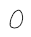{width="0.3229166666666667in" height="0.3854166666666667in"}{width="0.3854166666666667in" height="0.25in"}{width="2.0416666666666665in" height="2.09375in"}{width="0.5625in" height="0.5625in"}{width="0.3645833333333333in" height="0.19791666666666666in"}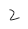{width="0.2916666666666667in" height="0.3020833333333333in"}{width="0.5833333333333334in" height="0.59375in"}{width="0.5625in" height="0.5729166666666666in"}{width="0.5625in" height="0.5520833333333334in"}{width="1.7916666666666667in" height="1.8020833333333333in"}{width="2.0625in" height="2.0104166666666665in"}{width="1.7916666666666667in" height="1.8020833333333333in"}{width="0.6875in" height="0.21875in"}{width="0.5520833333333334in" height="0.5729166666666666in"}{width="0.22916666666666666in" height="0.28125in"}{width="0.23958333333333334in" height="0.20833333333333334in"}{width="1.6354166666666667in" height="1.65625in"}{width="0.5416666666666666in" height="0.5729166666666666in"}{width="0.28125in" height="0.19791666666666666in"}{width="0.19791666666666666in" height="0.2916666666666667in"}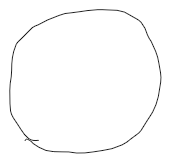{width="1.7708333333333333in" height="1.6875in"}{width="0.2708333333333333in" height="0.19791666666666666in"}{width="0.25in" height="0.3854166666666667in"}{width="0.4166666666666667in" height="0.2604166666666667in"}{width="0.5520833333333334in" height="0.5729166666666666in"}{width="0.25in" height="0.3645833333333333in"}{width="0.2604166666666667in" height="0.3020833333333333in"}{width="0.25in" height="0.3541666666666667in"}{width="0.22916666666666666in" height="0.3125in"}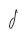{width="0.2708333333333333in" height="0.3958333333333333in"}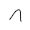{width="0.3125in" height="0.3125in"}{width="0.4270833333333333in" height="0.3958333333333333in"}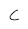{width="0.2916666666666667in" height="0.3020833333333333in"}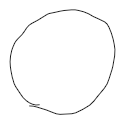{width="1.2916666666666667in" height="1.28125in"}{width="0.28125in" height="0.3333333333333333in"}{width="0.3645833333333333in" height="0.23958333333333334in"}{width="0.53125in" height="0.2604166666666667in"}{width="0.28125in" height="0.2604166666666667in"}{width="0.5416666666666666in" height="0.6354166666666666in"}{width="0.21875in" height="0.3125in"}{width="0.2708333333333333in" height="0.2604166666666667in"}{width="0.23958333333333334in" height="0.3541666666666667in"}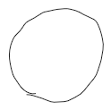{width="1.2916666666666667in" height="1.28125in"}{width="0.2604166666666667in" height="0.2708333333333333in"}{width="0.2604166666666667in" height="0.3229166666666667in"}{width="0.21875in" height="0.3125in"}{width="0.25in" height="0.21875in"}{width="0.5729166666666666in" height="0.59375in"}{width="0.625in" height="0.5104166666666666in"}{width="0.53125in" height="0.5104166666666666in"}{width="0.20833333333333334in" height="0.19791666666666666in"}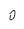{width="0.25in" height="0.3020833333333333in"}{width="0.5833333333333334in" height="0.5in"}{width="0.28125in" height="0.3645833333333333in"}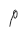{width="0.2708333333333333in" height="0.3645833333333333in"}{width="0.22916666666666666in" height="0.20833333333333334in"}{width="0.5625in" height="0.59375in"}{width="0.20833333333333334in" height="0.28125in"}{width="1.6145833333333333in" height="1.6770833333333333in"}{width="0.5625in" height="0.5833333333333334in"}{width="0.21875in" height="0.3229166666666667in"}{width="0.3333333333333333in" height="0.22916666666666666in"}{width="0.3645833333333333in" height="0.20833333333333334in"}{width="0.2604166666666667in" height="0.22916666666666666in"}{width="0.5520833333333334in" height="0.5833333333333334in"}{width="1.9375in" height="2.0625in"}{width="0.3958333333333333in" height="0.22916666666666666in"}{width="0.5416666666666666in" height="0.5833333333333334in"}{width="0.2916666666666667in" height="0.3229166666666667in"}{width="0.59375in" height="0.5729166666666666in"}{width="0.3125in" height="0.21875in"}{width="0.21875in" height="0.3333333333333333in"}{width="0.21875in" height="0.23958333333333334in"}{width="0.2916666666666667in" height="0.20833333333333334in"}{width="0.5625in" height="0.25in"}{width="0.3541666666666667in" height="0.21875in"}{width="0.23958333333333334in" height="0.19791666666666666in"}{width="0.5625in" height="0.5833333333333334in"}{width="0.22916666666666666in" height="0.20833333333333334in"}{width="0.5520833333333334in" height="0.5416666666666666in"}{width="0.6145833333333334in" height="0.6041666666666666in"}{width="0.2916666666666667in" height="0.22916666666666666in"}{width="0.25in" height="0.21875in"}{width="0.23958333333333334in" height="0.19791666666666666in"}{width="0.5520833333333334in" height="0.59375in"}{width="0.5625in" height="0.5833333333333334in"}{width="0.3125in" height="0.40625in"}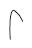{width="0.3333333333333333in" height="0.5in"}{width="0.2708333333333333in" height="0.20833333333333334in"}{width="0.21875in" height="0.375in"}{width="0.5833333333333334in" height="0.5833333333333334in"}{width="0.6041666666666666in" height="0.5729166666666666in"}{width="0.4166666666666667in" height="0.25in"}{width="0.5625in" height="0.6041666666666666in"}{width="0.3333333333333333in" height="0.3645833333333333in"}{width="0.5729166666666666in" height="0.5625in"}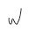{width="0.34375in" height="0.375in"}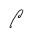{width="0.3333333333333333in" height="0.3854166666666667in"}{width="0.23958333333333334in" height="0.3541666666666667in"}{width="0.2708333333333333in" height="0.2916666666666667in"}{width="0.3333333333333333in" height="0.2708333333333333in"}{width="0.28125in" height="0.2604166666666667in"}{width="0.2916666666666667in" height="0.2604166666666667in"}{width="0.21875in" height="0.2916666666666667in"}{width="0.2708333333333333in" height="0.28125in"}{width="0.3125in" height="0.28125in"}{width="0.3333333333333333in" height="0.20833333333333334in"}{width="0.5208333333333334in" height="0.3541666666666667in"}{width="0.23958333333333334in" height="0.3645833333333333in"}{width="0.5in" height="0.22916666666666666in"}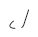{width="0.3958333333333333in" height="0.3854166666666667in"}{width="0.2708333333333333in" height="0.2916666666666667in"}{width="0.2604166666666667in" height="0.3020833333333333in"}{width="0.2708333333333333in" height="0.34375in"}{width="0.3333333333333333in" height="0.23958333333333334in"}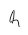{width="0.2916666666666667in" height="0.3645833333333333in"}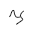{width="0.34375in" height="0.34375in"}{width="0.2604166666666667in" height="0.3020833333333333in"}{width="0.28125in" height="0.3125in"}{width="0.25in" height="0.2604166666666667in"}{width="0.3020833333333333in" height="0.2916666666666667in"}{width="0.2916666666666667in" height="0.2708333333333333in"}{width="0.3541666666666667in" height="0.3541666666666667in"}{width="0.2708333333333333in" height="0.2604166666666667in"}{width="0.20833333333333334in" height="0.3645833333333333in"}{width="2.6875in" height="0.53125in"}{width="0.4375in" height="0.20833333333333334in"}
-   Can be attractive or repulsive
-   Strength depends on the magnitude of the dipole

    -   The greater the dipole moment (polarity), the greater the attraction

```{=html}
<!-- -->
```
-   Temporary
-   Relies on orientation of molecules
-   Always attractive (electrons repelled away, negative part of dipole attracted to positive part of induced dipole)
-   Dipole-induced dipole happens when there is a mixture of polar and nonpolar molecules - THERE MUST BE BOTH

```{=html}
<!-- -->
```
-   Molecule is only polar because electron position at the given time
-   LDF are very temporary
-   The larger the electron cloud, the more polar it can be (more electrons, more protons, more potential for forces) - POLARIZABILITY

    -   LDF can be quite strong with large molecules, can even outweigh the forces of dipole-dipole and dipole-induced
-   LDF creates dipoles, these dipoles can then induce more dipoles
-   ALL molecules exhibit LDF, even polar molecules

Hydrogen Bonds
-   Special case of dipole-dipole interaction - happens when hydrogen is bonded with Nitrogen, Oxygen, Fluorine (N, O, F)
-   Why?

    -   N, O, and F are very electronegative

    -   Hydrogen's electron is pulled very close to the N/O/F

        -   Leaves a bare proton

    -   Another N/O/F from a different molecule is very attracted to the bare proton

    -   Hydrogen MUST BE bonded to N/O/F, the molecule attracted to the hydrogen MUST BE N/O/F

{width="2.1041666666666665in" height="2.21875in"}{width="1.5416666666666667in" height="1.5625in"}{width="0.3125in" height="0.4375in"}{width="0.5625in" height="0.5625in"}{width="0.5625in" height="0.6145833333333334in"}{width="0.3020833333333333in" height="0.3854166666666667in"}{width="0.3125in" height="0.3333333333333333in"}{width="0.28125in" height="0.3229166666666667in"}{width="0.23958333333333334in" height="0.2916666666666667in"}{width="0.2604166666666667in" height="0.21875in"}{width="0.4895833333333333in" height="0.4895833333333333in"}{width="0.53125in" height="0.4375in"}{width="0.21875in" height="0.19791666666666666in"}{width="0.25in" height="0.23958333333333334in"}{width="2.1041666666666665in" height="2.21875in"}{width="0.20833333333333334in" height="0.2708333333333333in"}{width="0.5833333333333334in" height="0.53125in"}{width="0.22916666666666666in" height="0.3020833333333333in"}{width="0.22916666666666666in" height="0.19791666666666666in"}{width="0.20833333333333334in" height="0.28125in"}{width="0.2604166666666667in" height="0.21875in"}{width="0.5520833333333334in" height="0.5208333333333334in"}{width="0.5833333333333334in" height="0.53125in"}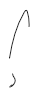{width="0.3958333333333333in" height="1.0in"}{width="0.3229166666666667in" height="0.2708333333333333in"}{width="1.5416666666666667in" height="1.5625in"}{width="0.3125in" height="0.4375in"}{width="0.5625in" height="0.5625in"}{width="0.5625in" height="0.6145833333333334in"}{width="0.3020833333333333in" height="0.3854166666666667in"}{width="0.3125in" height="0.3333333333333333in"}{width="0.28125in" height="0.3229166666666667in"}{width="0.23958333333333334in" height="0.2916666666666667in"}{width="0.2604166666666667in" height="0.21875in"}{width="0.4895833333333333in" height="0.4895833333333333in"}{width="0.6041666666666666in" height="0.4166666666666667in"}{width="0.21875in" height="0.19791666666666666in"}{width="0.25in" height="0.23958333333333334in"}{width="0.22916666666666666in" height="0.3854166666666667in"}{width="0.34375in" height="0.23958333333333334in"}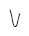{width="0.3020833333333333in" height="0.375in"}{width="0.20833333333333334in" height="0.2708333333333333in"}{width="0.22916666666666666in" height="0.3020833333333333in"}{width="0.2708333333333333in" height="0.2916666666666667in"}{width="0.40625in" height="0.3229166666666667in"}{width="0.22916666666666666in" height="0.19791666666666666in"}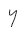{width="0.2708333333333333in" height="0.3645833333333333in"}{width="0.22916666666666666in" height="0.2708333333333333in"}{width="0.20833333333333334in" height="0.28125in"}{width="0.28125in" height="0.28125in"}{width="0.2604166666666667in" height="0.21875in"}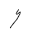{width="0.3020833333333333in" height="0.3854166666666667in"}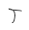{width="0.3333333333333333in" height="0.3541666666666667in"}{width="0.3333333333333333in" height="0.3541666666666667in"}{width="0.3958333333333333in" height="0.3125in"}{width="0.3229166666666667in" height="0.21875in"}{width="0.3125in" height="0.21875in"}


