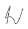
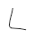
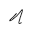
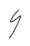
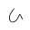

# Kinetic Molecular Theory
-   Particles are in continuous random motion
-   Between collisions, particles have constant velocity and direction
-   After collision, particles have a new velocity a direction
-   Collisions are elastic - do not lose energy in a collision

-   Lighter particles move faster - less mass
-   Temperature is the same
-   Kinetic energy = mV^2/2 =>

    -   Since temperature is measurement of KE, if particles are heavier, they must have less velocity
-   However, molecular size is so small compared to the container it is negligible
-   ASSUME IDEALITY - size of particles is ZERO

{width="9.572916666666666in" height="0.4479166666666667in"}

KINETIC MOLECULAR THEORY
-   Summarizes ideal behavior of gases

    -   Random, continuous motion

    -   Perfectly elastic collision - no energy lost in collisions

    -   No significant volume

    -   Constant temperature = Kinetic energy of all particles is the same

{width="10.0625in" height="0.3020833333333333in"}

PARTICLE SPEED
-   Individual speed of particles is always changing
-   Particle speed - 0 to 1500 m/s at room temperature
-   Distribution of particle speed remains consistent due to large # of particles
-   MAXWELL-BOLTZMANN DISTRIBUTION

    -   Shows how particle speed is distributed in a given sample

    -   x axis => particle speed

    -   y axis => number of particles @ speed

    -   Area under curve ALWAYS EQUALS 100% of particles inside the sample (all x values added together should add to 1)

M-B distribution for cold gas vs hot gas:

{width="6.427083333333333in" height="3.1458333333333335in"}

M-B distribution for heavy vs light gas:

{width="0.2708333333333333in" height="0.4791666666666667in"}{width="0.25in" height="0.5520833333333334in"}{width="6.427083333333333in" height="3.1979166666666665in"}{width="0.2916666666666667in" height="0.3541666666666667in"}{width="0.3333333333333333in" height="0.3125in"}{width="0.4375in" height="0.2604166666666667in"}{width="4.78125in" height="2.9270833333333335in"}{width="0.3854166666666667in" height="0.4895833333333333in"}{width="0.28125in" height="0.2916666666666667in"}{width="0.4895833333333333in" height="0.23958333333333334in"}{width="0.3333333333333333in" height="0.4895833333333333in"}{width="0.5in" height="0.4791666666666667in"}{width="0.4375in" height="0.2708333333333333in"}{width="0.19791666666666666in" height="0.20833333333333334in"}{width="0.4166666666666667in" height="0.22916666666666666in"}{width="0.3125in" height="0.4583333333333333in"}{width="0.23958333333333334in" height="0.3333333333333333in"}{width="0.3645833333333333in" height="0.4791666666666667in"}{width="0.5in" height="0.53125in"}{width="0.3854166666666667in" height="0.4479166666666667in"}{width="0.40625in" height="0.5625in"}{width="0.5in" height="0.375in"}{width="0.19791666666666666in" height="0.19791666666666666in"}{width="0.3333333333333333in" height="0.34375in"}{width="0.3333333333333333in" height="0.3229166666666667in"}{width="0.34375in" height="0.4166666666666667in"}{width="0.2708333333333333in" height="0.34375in"}{width="0.3020833333333333in" height="0.20833333333333334in"}{width="0.3125in" height="0.4791666666666667in"}{width="0.20833333333333334in" height="0.2708333333333333in"}{width="0.3958333333333333in" height="0.4895833333333333in"}{width="0.20833333333333334in" height="0.4375in"}{width="0.375in" height="0.5416666666666666in"}{width="0.2708333333333333in" height="0.3020833333333333in"}{width="0.3854166666666667in" height="0.5520833333333334in"}{width="6.020833333333333in" height="1.7083333333333333in"}{width="0.6770833333333334in" height="0.46875in"}{width="0.2916666666666667in" height="0.5in"}{width="0.3229166666666667in" height="0.4583333333333333in"}{width="0.3229166666666667in" height="0.28125in"}{width="0.34375in" height="0.3541666666666667in"}{width="0.40625in" height="0.4895833333333333in"}{width="0.34375in" height="0.4791666666666667in"}{width="0.28125in" height="0.3229166666666667in"}{width="0.25in" height="0.3125in"}{width="0.3229166666666667in" height="0.3229166666666667in"}

