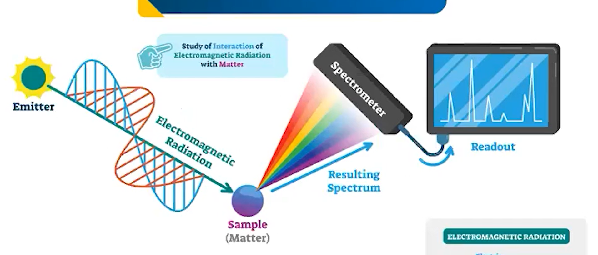
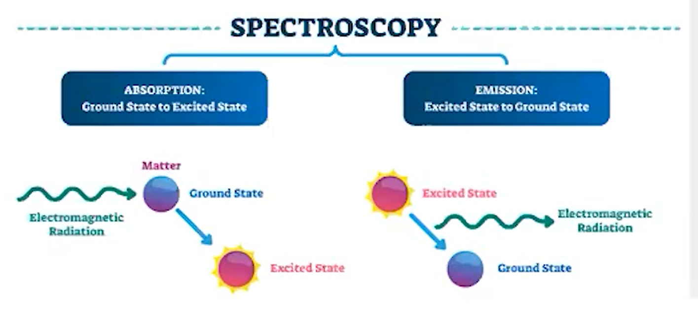
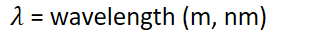
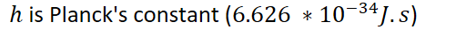

# Photoelectric Effect

Spectroscopy - the measurement of spectra produced when matter emits or is hit with electromagnetic radiation

Study of how magnetic radiation interacts with matter

{width="7.645833333333333in" height="3.2604166666666665in"}
-   Absorption - ground state => excited state

    -   Electrons are excited, energy level increases
-   Emission - excited state => ground state

    -   Electrons end excitement, energy level decreases

{width="7.125in" height="3.2708333333333335in"}
-   Wavelength of photon emitted - inversely proportional to frequency
-   {width="1.5104166666666667in" height="0.3333333333333333in"}

    -   Where c = speed of light

    -   {width="3.3333333333333335in" height="0.3541666666666667in"}

    -   {width="5.520833333333333in" height="0.3541666666666667in"}
-   Photon is absorbed - energy is increased/decreased by the energy of the photon
-   {width="6.229166666666667in" height="0.6875in"}
-   {width="1.5104166666666667in" height="0.3333333333333333in"}

    -   {width="4.947916666666667in" height="0.3541666666666667in"}

{width="5.333333333333333in" height="0.3541666666666667in"}

{width="3.4791666666666665in" height="0.3541666666666667in"}

