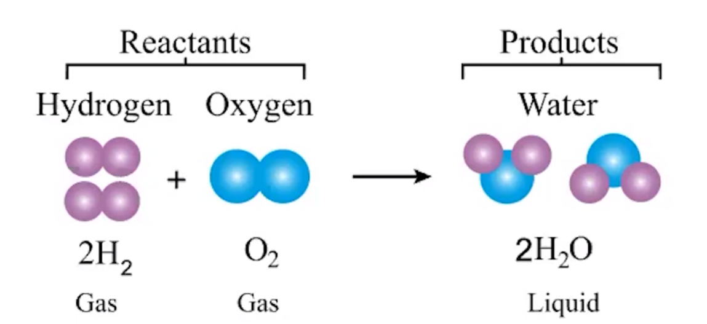

# Net Ionic Equations
-   Balanced equations can be used to represent physical processes:

    -   H2O(s) => H2O(l)

    -   Balanced equation - 2 H on either side, 1 O on either side
-   Balanced equations can also be used to represent chemical changes

    -   Mass is conserved (no atoms are created/destroyed) in chemical reaction

{width="5.229166666666667in" height="2.3958333333333335in"}
-   Same number of atoms of each element on each side
-   Spectator ion - an ion that is not undergoing a chemical change (H+ => H+, Na+ => Na+, etc)

<table><colgroup><col style="width: 22%" /><col style="width: 77%" /></colgroup><thead><tr class="header"><th>Balanced Molecular Equation</th><th>
Show all species participating in a reaction

Indicate that mass is conserved

2NaOH (aq) + CuSO4(aq) =&gt; Na2SO4(aq) + Cu(OH)2(s)
</th></tr></thead><tbody><tr class="odd"><td>Complete Ionic Equation</td><td>
Shows ions in aqueous solution as separate charged particles (NaOH =&gt; Na+ + OH-)

Used to identify and cross out spectator ions

2Na+(aq) + 2OH-(aq) + 2Cu2+(aq) + 2SO42-(aq) =&gt; 2Na+(aq) + SO42-(aq) + Cu(OH)2(s)
</td></tr><tr class="even"><td>Net Ionic Equation</td><td>
Do not include spectator ions

2OH-(aq) + 2Cu2+(aq) =&gt; Cu(OH)2(s)
</td></tr></tbody></table>

-   Precipitation reaction - 2 solutions are mixed, solid forms
-   Precipitate - the solid that forms from a precipitation reaction

