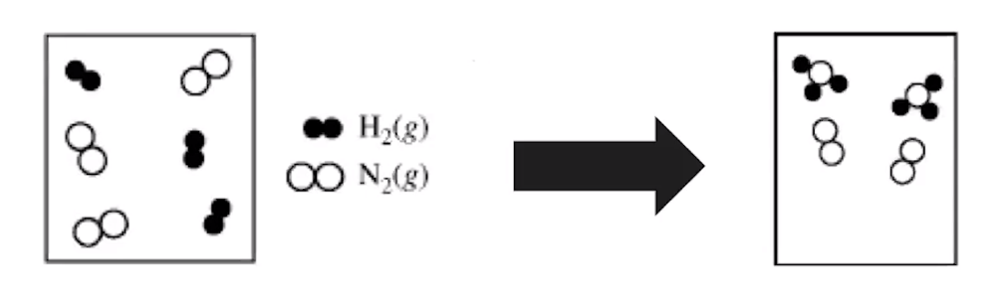

# Representations of reactions
-   Chemical reactions can be represented in 2 different ways

    -   Chemical symbols for:

        -   Reactants, products, states of matter

        -   N2(g)+3H2(g) => 2NH3(g)

    -   Particulate models

{width="4.5625in" height="1.3958333333333333in"}
-   Subscripts are unchangeable and represent compounds - O~2~, etc
-   Coefficients are changeable and are used to balance mass of equations
-   Particle representations can effectively show atom sizes and molecular sizes

    -   Particulate representations STILL need to be balanced

    -   Compounds STILL need to be accurate (O~2~, etc must be pairs)

