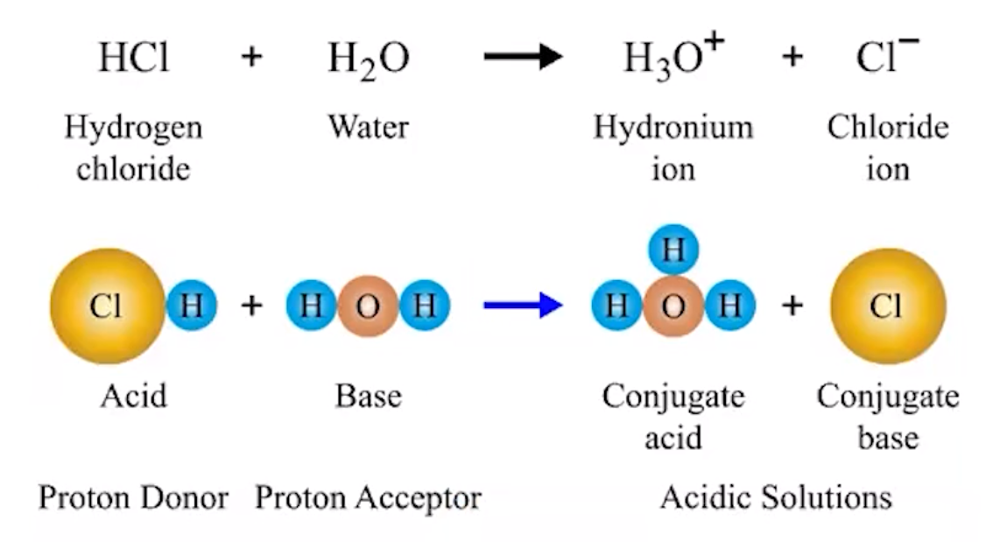
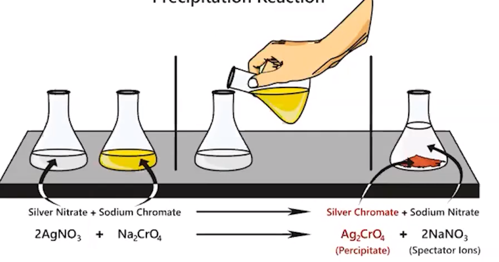

# Types of chemical reactions
-   Acid-base reactions
-   Oxidation-reduction reactions (redox)
-   Precipitation reactions

**Acid-base reactions**
-   When solutions of an acid and base are mixed a neutralization reaction occurs
-   Bronsted-Lowry acid-base reaction

    -   Transfer of one or more H+ (protons) from acid to base

{width="7.927083333333333in" height="4.291666666666667in"}
-   **Acid - proton (H+) donor**
-   **Base - proton (H+) receiver**
-   Products are usually water and an ionic compound (a salt)
-   **Conjugate acid-base pairs**

    -   Every acid has a conjugate base that it turns into

        -   Formed by removing an H+

        -   Ex: HCL => CL^-^

    -   Every base has a conjugate acid that it turns into

        -   Formed by adding an H+

        -   Ex: H~2~O = > H~3~O^+^

    -   2 sets of conjugate acid base pairs (acid, conjugate base and base, conjugate acid) can be identified

**Precipitation reactions**
-   Mixing ions in aqueous solutions that produce a solid, insoluble compound (the precipitate)

    -   All sodium (Na), potassium (K), ammonium (NH4^+^) and nitrate (NH~3~^+^) salts are soluble in water

    -   **Solubility Rules**

        -   Compounds with alkali metal (group 1) cation (Li, Na, K, etc) or ammonium (NH4+) are always soluble

        -   Compounds with NO3- are always soluble

{width="6.09375in" height="3.1979166666666665in"}

**Redox reaction**
-   Transfer of one or more electrons between reactions
-   Reduction: loss of oxygen atoms from a molecules, Oxidation: molecule/ion gains oxygen atoms

    -   Ex. Rusting of iron

        -   4Fe + 3O~2~ => 2Fe~2~O~3~

        -   Iron (Fe) has been oxidized (oxidation # 0 => 3+)

        -   Oxygen (O) has been reduced (oxidation # 0 => 2-)

    -   Electrons are transferred by the species that is oxidized to the species that is reduced

        -   Ex. Electrons go from iron => oxygen

    -   Loses electrons => oxidized

    -   Gains electrons => reduced

        -   OIL RIG - Oxidation Is Loss, Reduction Is Gain
-   **Oxidation Numbers**

    -   Atoms in elemental form => 0

    -   Monatomic (on their own) ions => oxidation # equals their charge

    -   Oxygen => usually -2

        -   Except in peroxides (2x group 1 ion and 2 oxygen: H~2~O~2~ or Li~2~O~2,~ etc) where it has oxidation # of -1

    -   Hydrogen => +1 when bonded to a metal -1 when bonded to a nonmetal

    -   Group 1 elements => +1

    -   Flourine => always -1

    -   **All oxidation numbers in a compound will add to the charge of that compound**

        -   For compounds with no charge, all oxidations numbers will add to 0

        -   For polyatomic ions, oxidation numbers will add to the charge

    -   **Use the known numbers (H, O, F, Gr. 1) and solve for the rest algebraically**

**Clues to identify**
-   Substance in elemental form => substance joined

    -   Usually redox

    -   Assign oxidation numbers to confirm
-   Substances differ by an H+

    -   Acid base
-   (aq) + (aq) => (s)

    -   Precipitation

