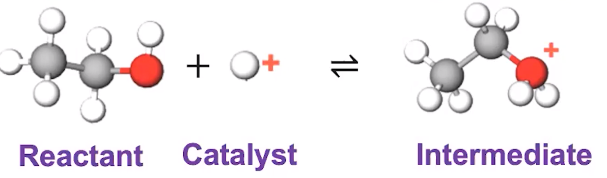
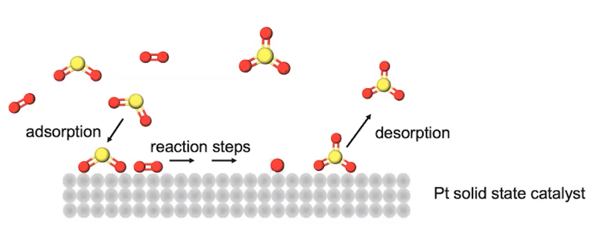

# Catalysis
-   A catalyst increases the reaction rate by providing an **alternative pathway** with **lower potential energy** for the activated complex
-   A catalyst often leads to the proposal of a new mechanism
-   A catalyst can increase the rate constant by:

    -   Formation of a more stable activated complex

    -   Increasing collision frequency

    -   Improving orientation effects
-   2 broad categories of catalysts

    -   Homogeneous catalyst

        -   The same **phase** as the reactants

            -   All species are aqueous, etc

        -   Ex:

            -   {width="5.708333333333333in" height="0.34375in"}

            -   {width="5.177083333333333in" height="1.5104166666666667in"}

    -   Heterogenous catalyst

        -   Reaction is different phase than a catalyst

        -   {width="4.854166666666667in" height="1.8229166666666667in"}

        -   Ex. Catalytic converter

            -   Contains metals and metal oxides

            -   Used as a catalyst to react with carbon monoxide, nitrogen monoxide, nitrogen dioxide

            -   Converted into substances better for the environment

