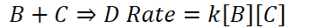

# Elementary Reactions
-   The rate law for an elementary reaction can be inferred from the stoichiometry of the participating molecules

    -   {width="4.875in" height="0.34375in"}

    -   {width="3.875in" height="0.3333333333333333in"}

    -   {width="7.770833333333333in" height="0.3541666666666667in"}

    ```{=html}
    <!-- -->
    ```
    -   Elementary reactions usually involve the collision of two molecules

        -   Simultaneous collision of 3+ particles are extremely rare

```{=html}
<!-- -->
```
-   **Reaction Mechanism**: the process by which a reaction occurs

    -   The elementary reactions in a multistep mechanism must always add to give the overall reaction for the overall process

    -   **Intermediates:** Substances that are formed in one elementary reaction then consumed in the next


