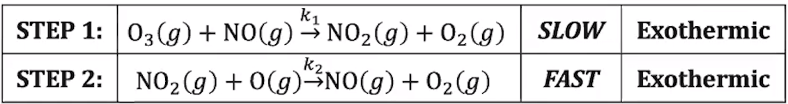
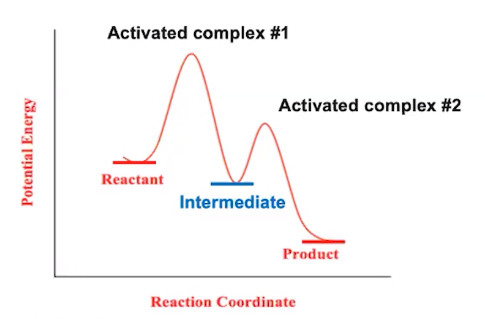
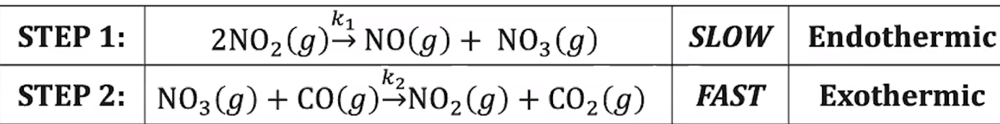
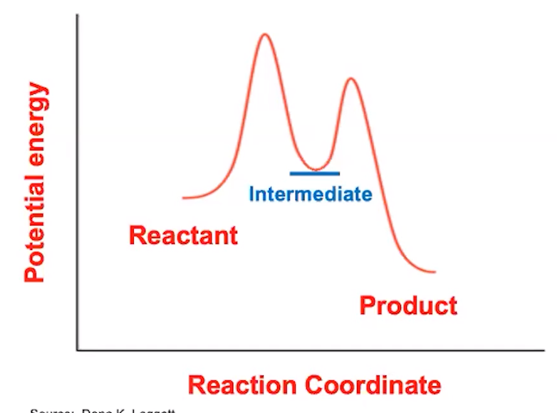
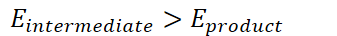
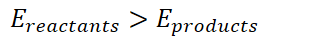
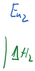

# Multistep reaction profiles

{width="7.84375in" height="1.0416666666666667in"}

{width="5.5in" height="3.6145833333333335in"}
-   Each "peak" represents a step
-   First step is slow

    -   Higher activation energy => slower (fewer **adequate** collisions)
-   Both are exothermic:

    -   {width="5.15625in" height="0.3333333333333333in"}
-   The addition of a catalyst typically leads to at least a two-step mechanism

{width="7.635416666666667in" height="0.9479166666666666in"}

{width="4.145833333333333in" height="3.0729166666666665in"}
-   First step is slow => higher activation energy
-   First step is endothermic

    -   {width="3.59375in" height="0.3333333333333333in"}
-   Second step is exothermic

    -   {width="3.5104166666666665in" height="0.375in"}
-   Overall reaction is exothermic

    -   {width="3.25in" height="0.375in"}

{width="6.09375in" height="1.1145833333333333in"}

{width="4.677083333333333in" height="3.4479166666666665in"}{width="0.2916666666666667in" height="1.65625in"}

Activated complex/

Act wed complex z

'riff-or

Potation Every .

in

{width="7.5in" height="3.2395833333333335in"}{width="0.25in" height="1.15625in"}{width="1.0in" height="0.125in"}

Activated complex}

{width="0.6041666666666666in" height="1.21875in"}

{width="0.22916666666666666in" height="1.0416666666666667in"}{width="1.3125in" height="0.14583333333333334in"}

ten

Ashy

{width="1.3020833333333333in" height="0.15625in"}

{width="1.7291666666666667in" height="0.15625in"}

scout

Reaction coo-din we

