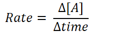
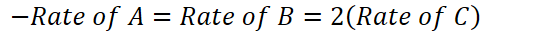
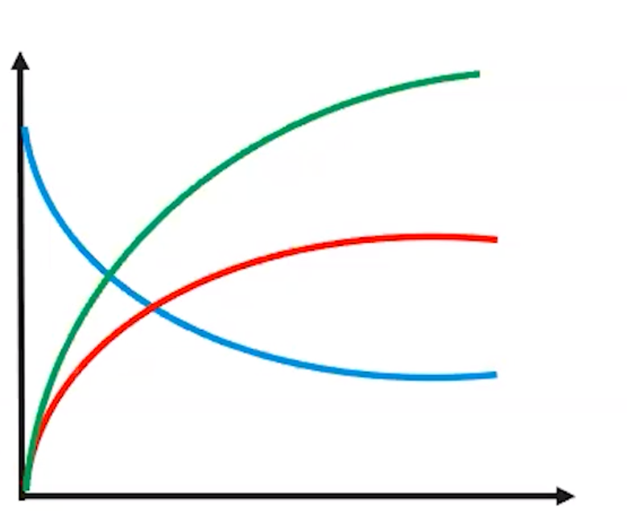

# Reaction Rates
-   **Kinetics** - the study of the rates of a chemical reaction

    -   The **rate** at which an amount of reactants is **converted** to products p**er unit of time**

    -   Rate of change is also determined by stoichiometry of the (balanced) chemical equation

    -   Can be determined by other factors: concentration of reactants, temperature, surface area, catalysts, environment...
-   Rate of appearance/disappearance: [A] = concentration of A

    -   {width="2.40625in" height="0.6666666666666666in"}

    -   Rate is ALWAYS positive

        -   If reactant is decreasing, NEGATE the rate to make it positive
-   A = B + 2C

    -   {width="5.5625in" height="0.3333333333333333in"}

    -   For every 1 A that disappears, 2 C appear (equation tells us this)

    -   Element C appears twice as rapidly as element B

{width="3.7395833333333335in" height="3.0729166666666665in"}
-   {width="4.0in" height="0.5104166666666666in"}

**Factors that affect reaction rate**
-   The rate of a reaction is influenced by anything that affects the number or force of collisions

    -   Concentration (gases & aqueous solutions)

        -   If particles are in a tighter space, they will collide more often

            -   {width="7.71875in" height="0.3333333333333333in"}

            -   {width="6.90625in" height="0.3333333333333333in"}

    -   Surface area (solids)

        -   Collisions only occur on surface of solids

        -   Increase the surface area => increase the rate of collision

        -   More atoms exposed to reaction

        -   Example: dissolving powdered vs rock sugar

    -   Temperature

        -   Particles move quicker =>

            -   Collide more often

            -   Collide with more force

    -   Catalysts (5.11)

