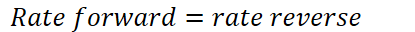
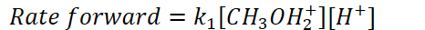
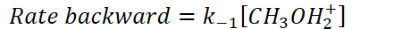
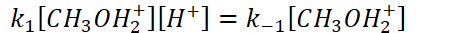
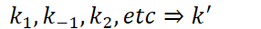

# Steady-state approximation

What do we do if the rate law expression includes an intermediate?
-   Intermediates cannot be controlled
-   It is okay for catalysts to show up in rate law expressions

    -   Catalysts are added to speed up the reaction

        -   We have control over it
-   Sometimes our slow step does involve an intermediate

**Fast Equilibrium**
-   What is equilibrium?

    -   Some reactions are reversible

        -   Double arrow to indicate reversible reactions

    -   At equilibrium, the rate of the forward reaction is equal to the rate of the reverse reaction

        -   Products => reactants and products => reactants are happening at the same rate

        -   {width="4.322916666666667in" height="0.3333333333333333in"}
-   Example of fast equilibrium:

    -   {width="3.71875in" height="0.34375in"}

    -   {width="4.854166666666667in" height="0.34375in"}

    -   {width="4.59375in" height="0.34375in"}

    -   Therefore,

    -   {width="4.791666666666667in" height="0.34375in"}

    -   Solve for the intermediate:

    -   {width="4.6875in" height="0.6979166666666666in"}

    -   {width="8.229166666666666in" height="0.875in"}
-   {width="8.166666666666666in" height="0.3541666666666667in"}

    -   {width="2.9791666666666665in" height="0.3333333333333333in"}

    -   {width="8.0625in" height="0.3541666666666667in"}

        -   The combination of rate constants from the steps in a mechanism
-   Fractional orders will exist because of this method!

    -   1/2 order => 4x molarity, 2x rate

    -   1/3 order => 8x molarity, 2x rate

    -   ...

