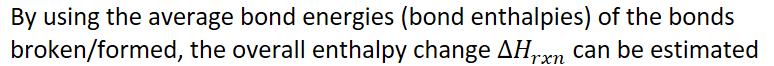
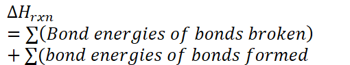
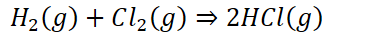

# Bond enthalpies
-   Atoms in a bond are more stable together than they are apart

    -   More stable = lower energy
-   Energy is required to break bonds (endothermic)

-   **Bond energy**: the energy stored in a bond

    -   If negative, it represents the energy released when the bond forms

    -   If positive, it represents the required energy to break the bond

    -   Example

        -   The bond energy of H-H bond is 436kJ/mol

            -   It takes 436kJ to break 1 mol of H-H bonds, and

            -   436kJ is released when 1 mole of H-H bonds are formed

    -   Bond energy increases as bond order (single, double, triple bond) increases

        -   Double bonds are stronger than single bonds (take more energy to break), triple bonds are even stronger
-   Why are bond energies useful?

    -   {width="8.0625in" height="0.6875in"}

        -   {width="5.3125in" height="0.9895833333333334in"}

        -   For bonds broken, value will be positive

        -   For bonds formed, value will be negative

    -   {width="3.9895833333333335in" height="0.3541666666666667in"}

        -   {width="3.9270833333333335in" height="0.3333333333333333in"}

        -   Using:

{width="3.0416666666666665in" height="1.8958333333333333in"}
-   {width="2.84375in" height="0.3333333333333333in"}
-   {width="2.9791666666666665in" height="0.3333333333333333in"}
-   {width="5.46875in" height="0.3333333333333333in"}
-   {width="4.854166666666667in" height="0.3333333333333333in"}
-   Reaction is exothermic (190kJ released)

