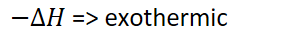
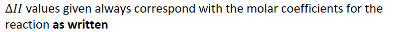

# Enthalpy of reaction
-   **Enthalpy change of a reaction**: the amount of heat energy released or absorbed by a chemical reaction at constant pressure

    -   {width="3.21875in" height="0.3541666666666667in"}

    -   {width="8.53125in" height="0.6875in"}

        -   All reactions in AP will be at constant pressure

    -   Same rules apply:

        -   {width="2.9270833333333335in" height="0.3541666666666667in"}

            -   Vice versa

    -   {width="8.53125in" height="0.6875in"}

    -   Example:

        -   {width="7.385416666666667in" height="0.65625in"}

        -   For every mole of CH~4~ that combusts, 890.1 kJ are released
-   Heat can be treated like a product if exothermic

    -   {width="6.625in" height="0.3333333333333333in"}
-   Heat can be treated like a reactant if exothermic

    -   {width="5.229166666666667in" height="0.3333333333333333in"}

