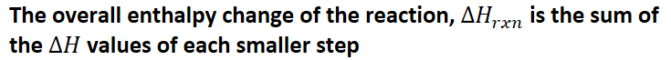
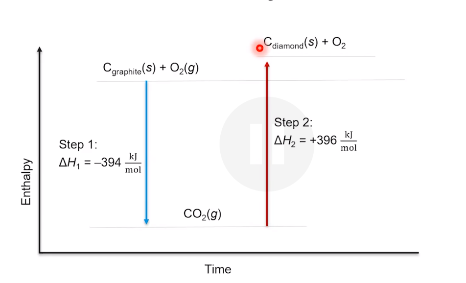

# Hess's law
-   Sometimes a chemical reaction can be broken down into a series of smaller steps

    -   {width="7.65625in" height="0.6875in"}
-   **The change in energy is the same whether the reaction occurs in one step or a series of smaller steps**

{width="6.604166666666667in" height="4.010416666666667in"}
-   If a reaction is reversed, the magnitude of the enthalpy stays the same, sign is reversed
-   If a reaction is multiplied by a factor make sure to multiply the change in enthalpy by that factor as well!
-   Work **backwards** to find steps

