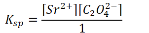

# Common-ion effect

Adding an ion in common with the insoluble (slightly soluble) salt
-   We have looked at solubility of slightly soluble salts in pure water

    -   Often, experiments include more than 1 ionic substance

    -   Can this change the solubility?
-   When adding an ion in common with the dissolved salt...

    -   The common ion will impact the equilibrium of the other reaction:

        -   Example:

            -   Begin with

            -   {width="4.947916666666667in" height="0.3645833333333333in"}

            -   Then add

            -   {width="5.395833333333333in" height="0.3645833333333333in"}

            -   {width="7.770833333333333in" height="0.6979166666666666in"}

    -   Le Chatalier approach:

        -   {width="3.1458333333333335in" height="0.6979166666666666in"}

        -   {width="2.4166666666666665in" height="0.3645833333333333in"}

        -   {width="3.65625in" height="0.375in"}

        -   {width="8.145833333333334in" height="0.3645833333333333in"}

            -   {width="7.770833333333333in" height="0.3645833333333333in"}

            -   In the presence of a common ion, solubility **decreases**

    -   WHEN ADDING EXPLICIT AMOUNTS TO A SOLUTION, REMEMBER TO CONVERT TO **CONCENTRATION,** NOT MOLES OR GRAMS

