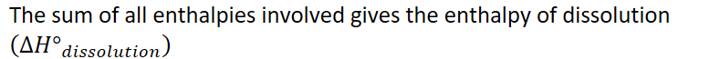
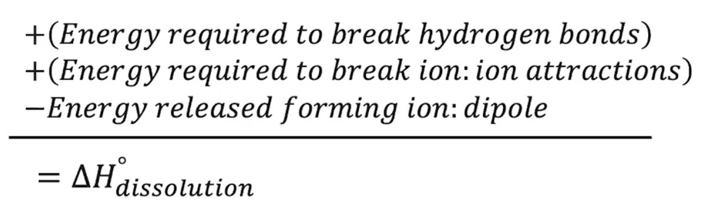

# Free Energy of Dissolution
-   Enthalpy/energy
-   Entropy/dispersion of energy throughout a system
-   These two mixed create the **free energy**

    -   The energy available to do work

    -   Helps us understand: thermodynamic favorability

        -   Is it favorable energy-wise to proceed with the reaction
-   To dissolve a salt:

    -   {width="5.010416666666667in" height="0.3541666666666667in"}

        -   Takes energy:

            -   Break hydrogen bonding between water molecules

            -   Break ionic bonds between cation and anion

        -   Releases energy:

            -   Form ion-dipole interactions between cations/anions and water molecule dipoles

        -   {width="8.21875in" height="0.6770833333333334in"}

{width="5.78125in" height="1.8020833333333333in"}
-   {width="6.96875in" height="0.3541666666666667in"}

    -   Positive enthalpy => REQUIRES energy
-   {width="6.6875in" height="0.3541666666666667in"}

    -   Negative enthalpy => RELEASES energy

```{=html}
<!-- -->
```
-   {width="4.84375in" height="0.3541666666666667in"}

    -   Entropy: a measure of the dispersal of energy and matter

    -   As the number of attractive forces decreases, molecules tend to separate

        -   Entropy increases

    -   Increase in entropy => more ways to arrange a system

        -   More **microstates**

    -   {width="3.6875in" height="0.3541666666666667in"}

    -   {width="3.6354166666666665in" height="0.3541666666666667in"}

    -   {width="3.7395833333333335in" height="0.3541666666666667in"}

    -   {width="4.21875in" height="0.3541666666666667in"}

```{=html}
<!-- -->
```
-   {width="6.020833333333333in" height="0.3541666666666667in"}

    -   {width="5.458333333333333in" height="0.3541666666666667in"}

        -   Free energy => energy available to do work

    -   {width="5.322916666666667in" height="0.3541666666666667in"}

    -   {width="3.8333333333333335in" height="0.3541666666666667in"}

    -   {width="5.166666666666667in" height="0.3541666666666667in"}

    ```{=html}
    <!-- -->
    ```
    -   {width="7.822916666666667in" height="0.3541666666666667in"}

        -   Requires energy

        -   The salt would be insoluble/slightly soluble

    ```{=html}
    <!-- -->
    ```
    -   {width="7.604166666666667in" height="0.3541666666666667in"}

        -   Releases energy

        -   The salt would be soluble


