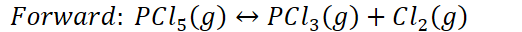
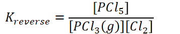
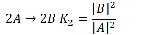
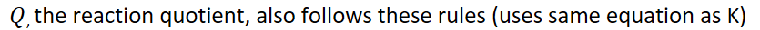

# Properties of the equilibrium constant
-   {width="6.5in" height="0.5625in"}

    -   Example:

        -   {width="5.4375in" height="0.3333333333333333in"}

        -   {width="3.8229166666666665in" height="0.7291666666666666in"}

        -   {width="5.489583333333333in" height="0.3333333333333333in"}

        -   {width="3.71875in" height="0.7083333333333334in"}
-   Reactions in series

    -   If more than one reaction occurs in a series,

        -   {width="7.895833333333333in" height="0.6875in"}

        -   For:

            -   {width="2.3020833333333335in" height="0.3333333333333333in"}

            -   {width="2.96875in" height="0.3333333333333333in"}

            -   {width="2.8125in" height="0.3333333333333333in"}

            -   {width="5.947916666666667in" height="0.3541666666666667in"}
-   Multiple reactions

    -   If stoichiometric coefficients of a reaction are multiplied by a factor, the exponents in K are raised to the power of that factor:

        -   K is raised to the power of the factor

            -   Double the equation => square K

        -   {width="2.5104166666666665in" height="0.7083333333333334in"}

        -   {width="2.9583333333333335in" height="0.7291666666666666in"}

        -   {width="4.697916666666667in" height="1.0416666666666667in"}
-   {width="8.697916666666666in" height="0.3541666666666667in"}

    -   {width="5.916666666666667in" height="0.3541666666666667in"}

