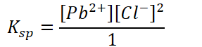
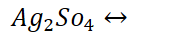
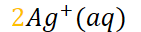
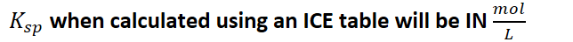
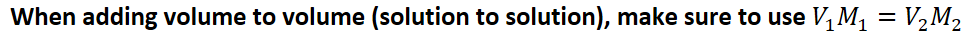

# Solubility Equilibria
-   Solubility: (S) Amount of salt that will dissolve to form a **saturated solution** at a given temperature

    -   {width="1.625in" height="0.65625in"}

    -   {width="6.322916666666667in" height="0.3541666666666667in"}

        -   Ions are the PRODUCT

        -   Solid is the REACTANT

    -   {width="4.75in" height="0.5in"}
-   Typical "Insoluble" salts are really **slightly** soluble

    -   They just don't dissolve very much

    -   {width="5.864583333333333in" height="0.3541666666666667in"}

        -   {width="2.9895833333333335in" height="0.6979166666666666in"}

            -   {width="4.385416666666667in" height="0.3541666666666667in"}
-   Solubility and ICE table

    -   

| Reaction    | {width="1.875in" height="0.3333333333333333in"} | {width="1.46875in" height="0.3333333333333333in"} | {width="1.65625in" height="0.34375in"} |
|-------------|--------------------------------------------------------------------------------------------------------------------------------------------|----------------------------------------------------------------------------------------------------------------------------------------------|-----------------------------------------------------------------------------------------------------------------------------------|
| Initial     | Some solid                                                                                                                                 | 0                                                                                                                                            | 0                                                                                                                                 |
| Change      | Evidence that                                                                                                                              | +2S                                                                                                                                          | +S                                                                                                                                |
| Equilibrium | Solution is saturated                                                                                                                      | 2S                                                                                                                                           | S                                                                                                                                 |
-   {width="6.552083333333333in" height="0.3854166666666667in"}

    -   2 shows up twice: mole ratio and definition of equilibrium constant
-   **ICE TABLES PRODUCT MOLES**
-   {width="6.708333333333333in" height="0.5in"}

    -   Convert to grams if needed

```{=html}
<!-- -->
```
-   Common ion ratios:

    -   

| 1:1 | NaCl            | {width="2.7708333333333335in" height="0.375in"}             |
|-----|-----------------|---------------------------------------------------------------------------------------------------------------------------------------------------------|
| 1:2 | Cu(IO~3~)~2~    | {width="3.3854166666666665in" height="0.34375in"}           |
| 1:3 | Cr(OH)~3~       | {width="3.5208333333333335in" height="0.375in"}             |
| 2:3 | Mg~3~(PO~4~)~2~ | {width="5.760416666666667in" height="0.3854166666666667in"} |
-   Make sure to account for parenthesis: square/cube the coefficients

**Q and solubility**
-   Comparing salt solubility

    -   {width="4.75in" height="0.375in"}

        -   Assume these salts are 100% soluble unless given/required a K value

        -   No clear boundary from insoluble to soluble: read question given!

    -   {width="9.833333333333334in" height="0.375in"}

        -   **Approach only works for equal ion salts**

        -   {width="2.90625in" height="0.3541666666666667in"}

            -   **Calculating using method above**

        -   **Different powers involved when comparing different salts with different subscripts**
-   Will a precipitate form?

    -   The precipitate is the **reactant;** ions are a **product**

        -   Solubility **product**

    -   {width="5.833333333333333in" height="0.375in"}

        -   {width="9.770833333333334in" height="0.7083333333333334in"}

        -   {width="9.770833333333334in" height="0.7083333333333334in"}

    -   {width="10.145833333333334in" height="0.7291666666666666in"}

    -   {width="10.1875in" height="0.3541666666666667in"}

        -   When adding volume, concentrations will change


