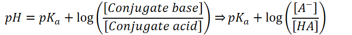
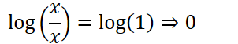

# Henderson-Hasselbalch Equation
-   pH of a buffer is related to the pK~a~ of the acid

    -   And the concentration ratio of the conjugate acid-base pair.

    ```{=html}
    <!-- -->
    ```
    -   Ratio is not changed significantly upon addition of acid or base

```{=html}
<!-- -->
```
-   Relationship can be described by the Henderson-Hasselbalch equation

    -   **Assume that equilibrium concentrations of the acid and its conjugate base are approx. equal to their initial concentrations**

    -   Initial concentrations of the acid and conjugate base are usually large
-   The equation:

    -   {width="7.520833333333333in" height="0.7604166666666666in"}

    -   Assume very little of the weak acid ionizes and forms conjugate base

        -   Initial concentration = equilibrium concentrations
-   Can also be used to qualitatively determine information about a reaction

    -   When acid and conjugate base concentrations are equal:

        -   {width="3.1458333333333335in" height="0.5833333333333334in"}

        -   Log term drops out

        -   {width="1.8541666666666667in" height="0.3333333333333333in"}

    -   When **conjugate base** concentration is **greater** than the **acid form**:

        -   Log term is positive

        -   {width="1.8541666666666667in" height="0.3333333333333333in"}

    -   When **conjugate base** concentration is **less** than the **acid form**:

        -   Log term is negative

        -   {width="1.8541666666666667in" height="0.3333333333333333in"}


