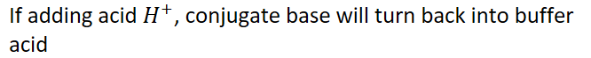

# Properties of Buffers
-   **Buffer:** a solution that is resistant to a change in pH upon addition of a strong acid or base

    -   Needs two substances:

        -   {width="6.822916666666667in" height="0.3541666666666667in"}

        -   {width="6.9375in" height="0.6770833333333334in"}

    -   Acid and base **must not react with each other**
-   Usually prepared from a **conjugate acid-base pair**

    -   **Special case of common-ion effect**

{width="6.520833333333333in" height="2.7708333333333335in"}
-   {width="6.020833333333333in" height="0.3541666666666667in"}
-   {width="6.9375in" height="0.6875in"}

