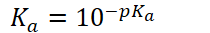
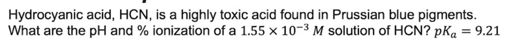
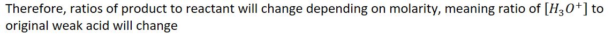

# Weak Acid and Base Equilibria

{width="12.333333333333334in" height="0.3541666666666667in"}

Same way to solve as equilibrium systems, except mole ratios are **usually** 1:1:1

Given pH and pOH are given AT EQUILIBRIUM
-   {width="4.104166666666667in" height="0.3541666666666667in"}

    -   {width="2.1875in" height="0.34375in"}
-   {width="8.666666666666666in" height="0.7708333333333334in"}

<table><colgroup><col style="width: 16%" /><col style="width: 27%" /><col style="width: 19%" /><col style="width: 21%" /><col style="width: 15%" /></colgroup><thead><tr class="header"><th></th><th></th><th></th><th></th><th></th></tr></thead><tbody><tr class="odd"><td>Initial</td><td></td><td>Some</td><td>0</td><td>0</td></tr><tr class="even"><td>Change</td><td>-x</td><td>-</td><td>+x</td><td>+x</td></tr><tr class="odd"><td>Equilibrium</td><td></td><td><ul class="incremental"><li>

</li></ul></td><td></td><td></td></tr></tbody></table>
-   Therefore,

    -   {width="4.104166666666667in" height="0.34375in"}

    -   {width="2.8125in" height="0.34375in"}

    -   {width="3.71875in" height="0.65625in"}

    -   {width="8.65625in" height="0.7291666666666666in"}

    -   {width="7.270833333333333in" height="0.375in"}

        -   Only do this when not doing so would lead to a quadratic equation

    -   {width="6.15625in" height="0.6979166666666666in"}

    -   {width="10.75in" height="0.6979166666666666in"}

    -   {width="2.53125in" height="0.34375in"}

    -   {width="5.010416666666667in" height="0.3541666666666667in"}

    -   {width="4.979166666666667in" height="0.34375in"}
-   {width="5.34375in" height="0.7395833333333334in"}

    -   What part of that original weak acid reacted to water and disassociated?

    -   {width="6.0in" height="0.6979166666666666in"}

**Percent ionization: what part of the original weak acid reacted with water and disassociated?**
-   Depends on molarity

    -   The easier it is for the H+ to break free from the molecule, the more it will disassociate
-   When solution is diluted, ALL molarities decrease

    -   {width="10.135416666666666in" height="0.5625in"}

        -   {width="7.979166666666667in" height="0.3541666666666667in"}

    -   {width="11.90625in" height="0.6875in"}

    -   **As molarity (concentration) decreases, percent ionization increases**

        -   Molarity changes will affect the product (ions) more than the reactant (weak acid) because there are 2 products and 1 reactant

            -   As molarity decreases, [products] decrease more than [reactants] decrease

            -   Therefore, reaction will shift to form more product, creating more ions, so %ionization increases

            -   And vice versa

**Weak Base Equilibria**
-   Solve the same way as weak acid equilibria except:

    -   Attention needs to be paid to mole ratios

    -   {width="3.96875in" height="0.3541666666666667in"}
-   {width="5.5625in" height="0.3333333333333333in"}
-   Remember: bases ACCEPT protons from water molecules forming hydroxide

{width="5.90625in" height="1.34375in"}
-   {width="4.6875in" height="0.7291666666666666in"}

