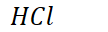
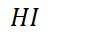
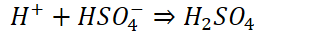
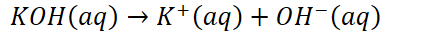
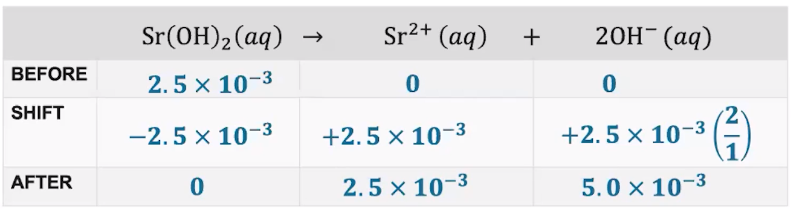

# pH and pOH of Strong Acids and Bases

**Dissociation of strong acids**
-   Strong acids are assumed to disassociate 100% unless stated/indicated otherwise

    -   Weak acids disassociate less

    -   Strong acids:

        -   {width="1.125in" height="0.3333333333333333in"}

        -   {width="1.1770833333333333in" height="0.3333333333333333in"}

        -   {width="0.96875in" height="0.3333333333333333in"}

        -   {width="1.4166666666666667in" height="0.3333333333333333in"}

        -   {width="1.375in" height="0.3333333333333333in"}

        -   {width="2.5104166666666665in" height="0.3541666666666667in"}

            -   {width="3.21875in" height="0.3333333333333333in"}

        -   {width="6.229166666666667in" height="0.3541666666666667in"}

            -   Still make sure to SPECIFY that ratio
-   Disassociation of **strong** acids is a **forward-only reaction**, so **stoichiometry** can be used

    -   {width="5.78125in" height="0.3333333333333333in"}

    -   {width="6.34375in" height="0.3333333333333333in"}
-   Disassociation of **weak acids** is **reversible**, so **equilibrium** must be used

    -   {width="6.197916666666667in" height="0.34375in"}
-   Using a before-shift-after chart:

    -   {width="7.75in" height="0.3541666666666667in"}

|       | {width="1.8333333333333333in" height="0.3333333333333333in"} | {width="1.0104166666666667in" height="0.6666666666666666in"} | {width="1.7604166666666667in" height="0.34375in"} | {width="1.8645833333333333in" height="0.3333333333333333in"} |
|--------|----------------------------------------------------------------------------------------------------------------------------------------------------------|----------------------------------------------------------------------------------------------------------------------------------------------------------|-----------------------------------------------------------------------------------------------------------------------------------------------|----------------------------------------------------------------------------------------------------------------------------------------------------------|
| Before | 5.992 * 10^-3^ M                                                                                                                                        |                                                                                                                                                         | 0                                                                                                                                             | 0                                                                                                                                                        |
| Shift  | -5.992 * 10^-3^ M                                                                                                                                       |                                                                                                                                                         | +1(5.992 * 10^-3^ )M                                                                                                                         | +1(5.992 * 10^-3^) M                                                                                                                                    |
| After  | 0                                                                                                                                                        |                                                                                                                                                         | 5.992 * 10^-3^ M                                                                                                                             | 5.992 * 10^-3^ M                                                                                                                                        |
-   {width="7.114583333333333in" height="0.34375in"}

**Disassociation of strong bases**
-   Strong bases are assumed to disassociate 100% unless clearly indicated (or given a K value)

    -   Strong bases:

        -   {width="5.822916666666667in" height="0.3541666666666667in"}
-   {width="4.53125in" height="0.3333333333333333in"}
-   {width="7.21875in" height="0.5104166666666666in"}
-   {width="4.9375in" height="0.3541666666666667in"}

    -   {width="8.125in" height="0.3541666666666667in"}

{width="9.25in" height="2.5208333333333335in"}

