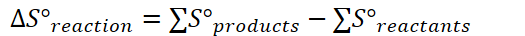

# Absolute Entropy and Entropy Changes

{width="10.135416666666666in" height="0.6875in"}
-   Absolute Entropy: an value, in joules per mole, that represents the entropy of a substance in its phase
-   Often measured on **joules** rather than **kilojoules**

    -   **Unlike enthalpy**
-   Every substance has a **nonzero** value for absolute entropy
-   The number of moles of each substance must be considered from calculating entropy

    -   Look at the balanced equation
-   {width="5.46875in" height="0.375in"}

    -   If result is **positive**: entropy **increases**

    -   If result is **negative**: entropy **decreases**

    -   {width="1.8333333333333333in" height="0.4895833333333333in"}
-   Entropy is **positive** if solid -> liquid -> gas

    -   **Negative** if gas -> liquid -> solid
-   Positive if **number of moles increases** from reactants to products

    -   Especially if a positive state change is also involved (solid -> liquid -> gas)
-   A positive entropy is thermodynamically favorable => matter will always want to be disorderly

    -   However, heat is required for this

