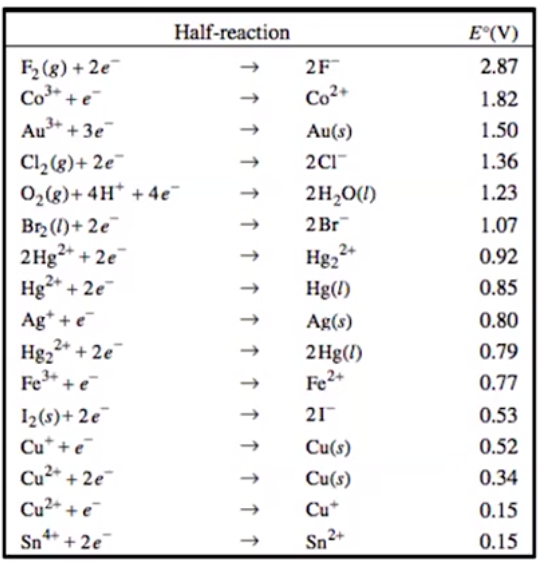
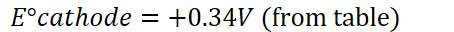

# Cell Potential and Free Energy
-   A reaction occurring in an electrochemical cell involves a **difference in electrical potential (voltage)** between the oxidation and reduction processes occurring in the half cells

    -   {width="7.072916666666667in" height="0.3541666666666667in"}
-   **Reduction Potentials:**

    -   {width="12.510416666666666in" height="0.6875in"}

        -   Accurate under **standard conditions:** 1M solutions, 1 atm gases, 25C

        -   Only apply for **reduction** and **standard potentials**

{width="3.75in" height="3.9166666666666665in"}
-   For an oxidation process, the **reduction half reaction** and the **sign of the voltage** are both reversed

    -   {width="5.104166666666667in" height="0.3541666666666667in"}

    -   {width="5.385416666666667in" height="0.3541666666666667in"}

```{=html}
<!-- -->
```
-   **Standard Cell Potential:**

    -   {width="12.59375in" height="0.6875in"}

    -   {width="4.041666666666667in" height="0.3333333333333333in"}

        -   {width="6.40625in" height="0.3541666666666667in"}

            -   {width="9.0in" height="0.3541666666666667in"}

        -   {width="9.59375in" height="0.3541666666666667in"}

    -   **Electrical potential DOES NOT depend on the AMOUNT of substances reacting**

        -   **DO NOT ACCOUNT FOR COEFFICIENTS**

{width="4.208333333333333in" height="4.40625in"}
-   {width="3.84375in" height="0.3541666666666667in"}

    -   {width="4.375in" height="0.3333333333333333in"}

```{=html}
<!-- -->
```
-   {width="4.104166666666667in" height="0.3541666666666667in"}

    -   {width="4.729166666666667in" height="0.3333333333333333in"}
-   {width="6.09375in" height="0.3541666666666667in"}
-   **Thermodynamic favorability and cell potential**

    -   Thermodynamically favorable reactions have **positive voltage (positive cell potential)**

        -   Therefore, all voltaic cells have **positive voltage**

    -   Thermodynamically **unfavorable** reactions have **negative voltage (negative cell potential)**

        -   All electrolytic cells have **negative cell potentials**

```{=html}
<!-- -->
```
-   **Cell Potential and Free Energy**

    -   {width="3.1979166666666665in" height="0.3541666666666667in"}

        -   The **negative of the cell potential** for the redox reaction from which it is constructed

        -   {width="7.25in" height="0.3541666666666667in"}

            -   {width="1.6666666666666667in" height="0.3333333333333333in"}

            -   Only count this once: don't count it once per side of the reaction

        -   {width="3.0625in" height="0.3541666666666667in"}

            -   {width="7.5625in" height="0.3541666666666667in"}

                -   {width="2.2604166666666665in" height="0.65625in"}

        -   {width="2.6666666666666665in" height="0.3333333333333333in"}

            -   Value produces **joules:** convert to kJ if needed

                -   {width="5.854166666666667in" height="0.3333333333333333in"}

    -   {width="4.083333333333333in" height="0.3541666666666667in"}

        -   Voltaic cells - thermodynamically favorable

    -   {width="4.166666666666667in" height="0.3541666666666667in"}

        -   Electrolytic cells, thermodynamically unfavorable


