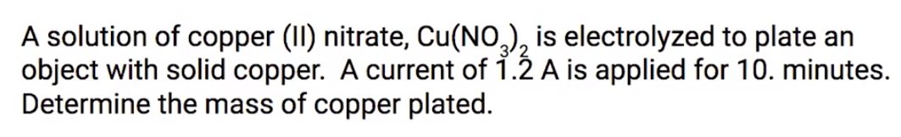
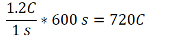
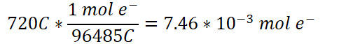
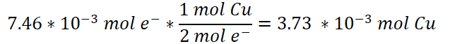

# Electrolysis and Faraday's Law

Charge flow in Electrolysis
-   {width="10.333333333333334in" height="0.6875in"}

    -   {width="5.916666666666667in" height="0.3333333333333333in"}
-   {width="8.760416666666666in" height="0.3541666666666667in"}
-   Stoichiometry is used for these relationships
-   **Pay attention to units**

    -   **Use dimensional analysis**
-   {width="4.989583333333333in" height="0.5208333333333334in"}
-   **Time needs to be in seconds when using Faraday's Law**
-   {width="4.25in" height="0.5in"}

    -   {width="3.46875in" height="0.3541666666666667in"}
-   {width="7.375in" height="1.125in"}

    -   How many electrons are needed to plate 1 mole of copper?

        -   {width="3.6979166666666665in" height="0.34375in"}

        -   2 mol electrons per 1 mol Cu

    -   {width="6.177083333333333in" height="0.3541666666666667in"}

    -   Convert amperage and time to total couloumbs:

        -   {width="3.1145833333333335in" height="0.65625in"}

    -   Find total number of electrons:

        -   {width="5.25in" height="0.65625in"}

    -   Find mols of Cu:

        -   {width="6.989583333333333in" height="0.65625in"}

    ```{=html}
    <!-- -->
    ```
    -   Convert mols to mass:

        -   {width="5.625in" height="0.65625in"}


