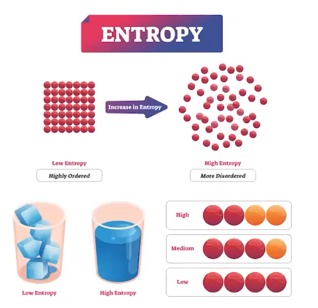

# Intro to Entropy

{width="8.59375in" height="0.3541666666666667in"}
-   Changes in entropy can be described as **a measure of how dispersed the energy or matter is in a particular system**

{width="4.53125in" height="4.375in"}
-   **Entropy = disorder/dispersal**
-   Increases when matter becomes more dispersed

    -   Example: phase changes from solid => liquid, liquid => gas

        -   Particles become more free to move and occupy a larger volume => dispersal

    -   Gases: Entropy increases when there is an increase in volume

        -   Gas molecules are able to move in a larger space
-   If moles (and therefore volume) of gaseous **products >** moles of gaseous **reactants:**

    -   **Entropy increases**

```{=html}
<!-- -->
```
-   Also increases when energy becomes more dispersed

    -   According to the Kinetic Molecular Theory, **the distribution of kinetic energy among the particles of a gas broadens as the temperature increases**

        -   Maxwell-Boltzmann distributions--higher temperature = wider distribution

```{=html}
<!-- -->
```
-   **Entropy increases as temperature increases**

    -   As a substance is heated, its entropy increases


