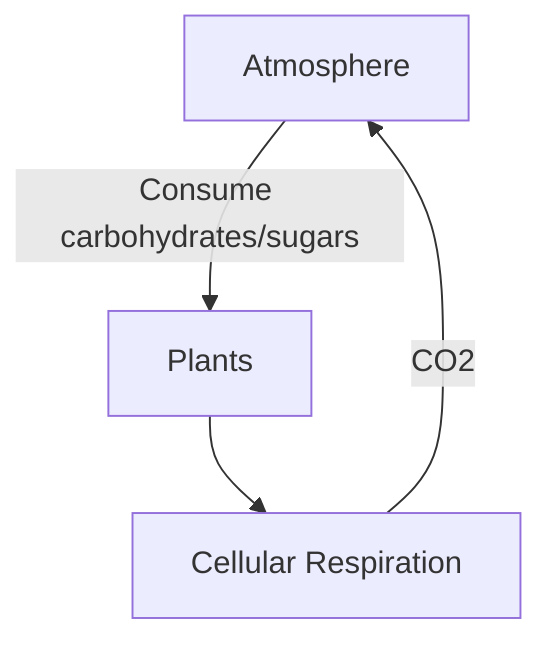
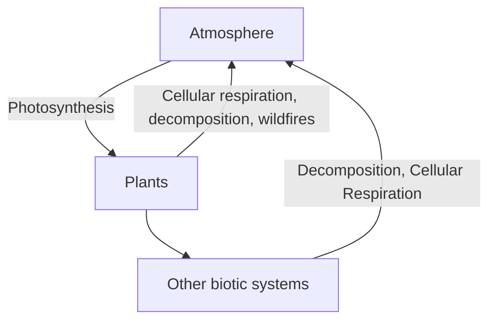

Carbon takes two forms - organic and inorganic

Inorganic: Gaseous $CO_2$, $CO$ (Carbon monoxide), Calcium carbonate $CaCO_3$ (shells)

Organic: Methane $CH_4$, Carbonic Acid (H_2CO_3), fossil fuels, peat

Carbon is the building block for organic compounds - carbohydrates, DNA, protein, fats, etc.

Relatively quick process because of gas phase in carbon cycle

Carbon pathway:

Main components: [[Photosynthesis]] and [[Cellular Respiration]]

Carbon enters biotic system through photosynthesis (absorbs carbon dioxide from atmosphere)

> Yearly around 15% of atmospheric carbon is taken by photosynthesis

Another carbon sink is the ocean, with benefits and drawbacks

> **Benefit:** greater photosynthetic yield in oceans, Can be converted into calcium carbonate, can produce shells and skeletons
> **Problem:** Can be converted into carbonic acid: $CO_2 + H_2O \rightarrow H_2CO_3$. Coral and other organisms can be very sensitive to pH level 

Carbon reservoirs: fossil fuels, living organisms, rocks/sediments, oceans, atmosphere

By burning fossil fuels, highly dense reservoirs of carbon are being burned off into the atmosphere 

Carbon is a major component of greenhouse gases, so it is important to know about atmospheric carbon.

![[Pasted image 20221010221531.png]]
