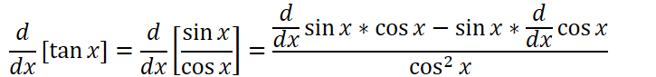
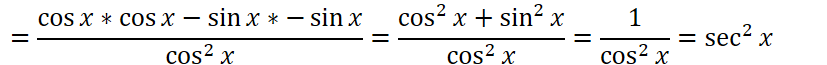
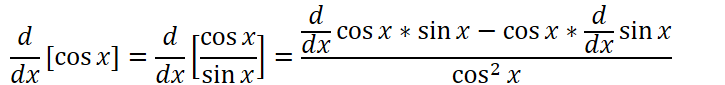
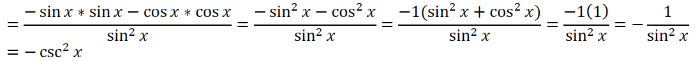
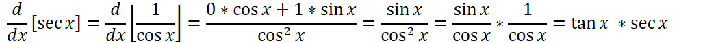
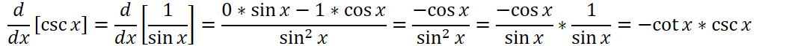

Derivative of sine and cosine

$$
\frac{d}{dx} \sin{x} = \cos{x}
$$

$$
\frac{d}{dx} \cos{x} = -\sin{x}
$$

Derivatives of the other trigonometric functions can be derived with the [[Product Rule]] and [[Quotient Rule]]

$$
\frac{d}{dx} \tan{x} = \sec^2{x}
$$

> Take derivatives of each with the [[Quotient Rule]], then apply the Pythagorean Identity

$$
\frac{d}{dx} \cot{x} = -\csc^2{x}
$$

> Take derivatives, Factor out -1, Pythagorean Identity

$$
\frac{d}{dx} \sec{x} = \sec x \tan x
$$

$$
\frac{d}{dx} \csc{x} = -\csc x \cot x
$$

> Derived with [[Quotient Rule]]