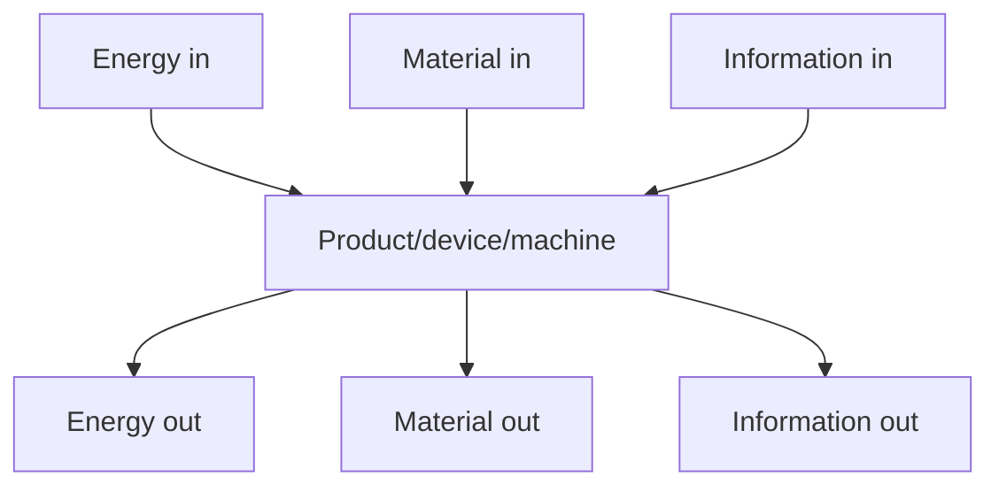

```mermaid
graph TD
	A["Energy in"]-->D
	B["Material in"]-->D
	C["Information in"]-->D
	D["Product/device/machine"]
	D-->E["Energy out"]
	D-->F["Material out"]
	D-->G["Information out"]
```

# Writing the Spec

- What are the inputs/outputs
- How fast/slow might it be?
- How uch should it cost?
- Who? When?
- Safety, regulations, lifetime, safety factor (overdesign)
