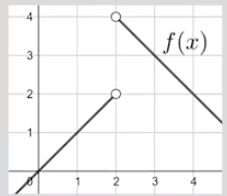
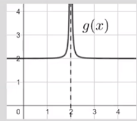
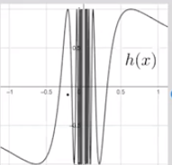

A **limit** is the value a function is **approaching**

The function may never reach it (undefined)

However, it appears as if the function is reaching that point for the particular x value

> The limit of *f(x)* as *x* approaches *n* is *m*
> $$\lim_{x \to n}{f(x)} = m$$

**The limit of the function may not be equal to the point on the function**

Estimating values from graphs:

The limit of *f(x)* as *x* approaches *n* from the left (negative) side is *m*:
$$\lim_{x \to n^-}{f(x)} = m$$

The limit of *f(x)* as *x* approaches *j* from the right (positive) side is *k*:
$$\lim_{x \to j^+}{f(x)} = k$$

The right and left limits may **not** be the same!
If the right and left side limits are the same, the limit exists
> Otherwise, it does not exist
> Either an infinity or undefined

Why would a limit not exist?

**Jump:**
- Left and right side limits will not be the same
- Therefore, a limit cannot be determined

**Unbounded:**
- Left and/or right side limits will be either $\infty$ or $-\infty$
- Therefore, the limit will be infinity

> This will be valid, but it also must be mentioned that the limit still "does not exist"

**Oscillating:**
- If a limit does not stop "bouncing" or oscillating (infinitely oscillating), the limit cannot be determined
- **Sometimes, the resolution of a graphing calculator will not make this clear**

