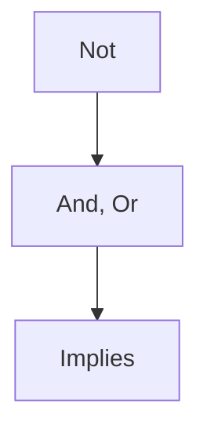

A statement is something that is either True or False

Logical connectives connect statements

Logical connectives 

| Symbol       | Name         |
| ------------ | ------------ |
| $\neg$       | Not          |
| $\lor$       | Or          |
| $\land$        | And          |
| $\rightarrow$ | Implies      |
| $\oplus$     | Exclusive or |
| $\iff$       | If and only if (iff)             |

Truth tables for $\neg$, $\land$, $\lor$, and $\oplus$ are standard

**Implies**

Whether the hypothesis is true (implies that) the consequence is true:
| P   | Q   | Z   |
| --- | --- | --- |
| T   | T   | T   |
| T   | F   | F   |
| F   | T   | T   |
| F   | F   | F   |

**If and only if**

The complement of $\oplus$

| P   | Q   | Z   |
| --- | --- | --- |
| T   | T   | T   |
| T   | F   | F   |
| F   | T   | F   |
| F   | F   | T   |

# Order of Operations

$\equiv$ is an equivalence test
