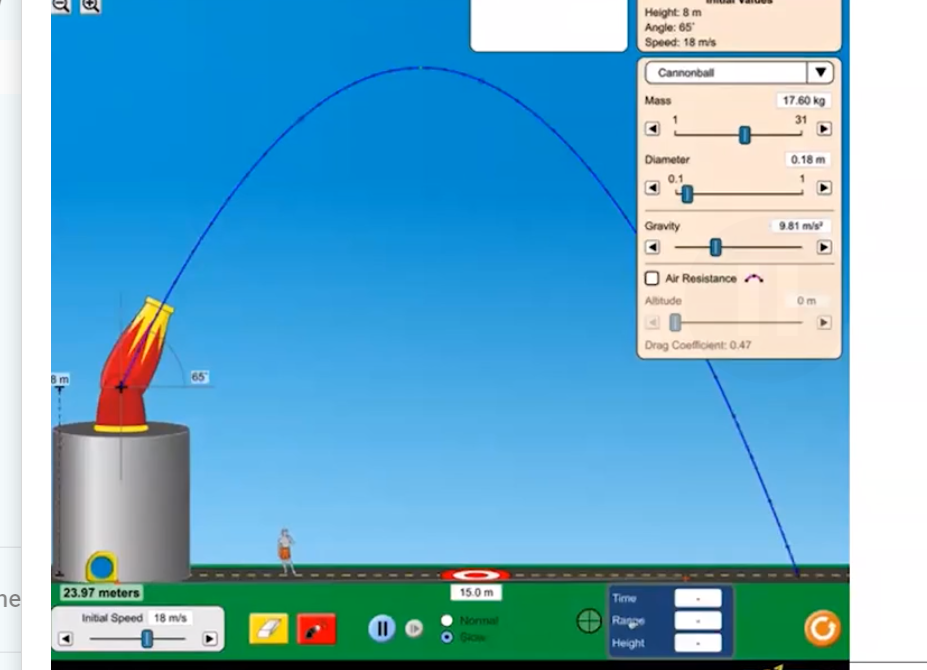

#APPhysics1 #Kinematics

How can we represent the motion of a projectile graphically for:

-   A projectile launched horizontally
-   A projectile launched at an angle

> In both cases, the horizontal velocity will **always stay the same** until it hits the ground, where it becomes zero

The vertical acceleration $a_y$ will always equal gravity

The position versus time graph will look like the trajectory of the object

General projectile motion rules:

-   Too large of an angle will produce a short flight distance (horizontal velocity is too small even though time in air is large)
-   Too small of an angle will produce a long flight time (horizontal velocity is large, but time in air is too small)
-   45 degree angle produces ideal flight time

**Complementary angles produce the same distance (20 and 70, 35 and 55, etc.)**
