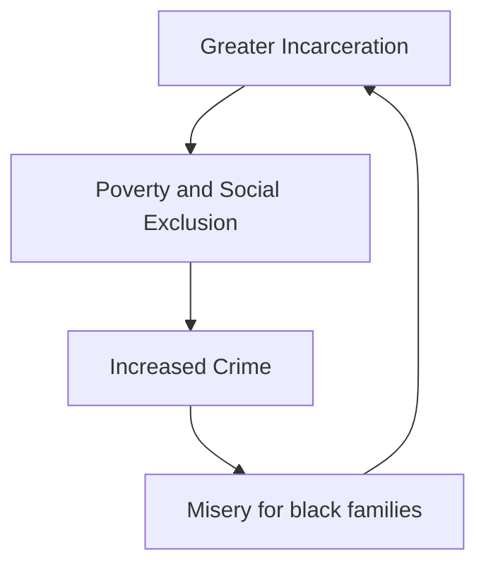

Ta-Nehesi Coates - "The Beautiful Struggle"

# Background: Daniel Patrick Moynihan

"The Negro Family" - 1965 report by Moynihan

Mentioned a "lack of employed black men of strong character"

If you "fix" the black family, then you fix poverty

[[Mass Incarceration]]

## The "Cycle of Misery"

[[Broken Windows Policing]]

The criminal penalty for crack versus powder cocaine is much higher for crack; crack is used by poorer (and typically black) people, whereas powder cocaine is used by rich people (think wall street)

![[Pasted image 20230924155914.png]]
