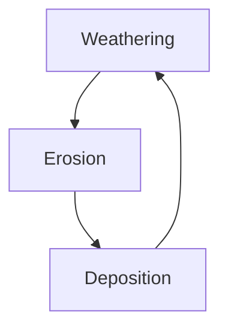

Series of processes that continually change rocks from one type to another

Breakdown of rocks lead to the formation of soil

Rock cycle:

Types of rocks in the region will affect the composition of the soil derived from it, influencing the plants/biotic members in the ecosystem
