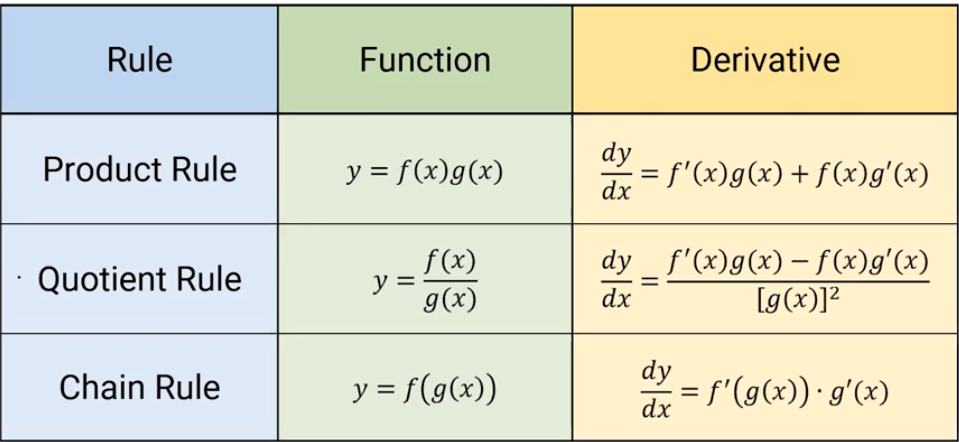

How to we select what rule to use?

Some problems may look like they require the chain rule, but look closely, they can simplify to an easier method

> Try to use the simplest rule you can

Derivatives can still be undefined, don't get too caught up in the rules to realize this
