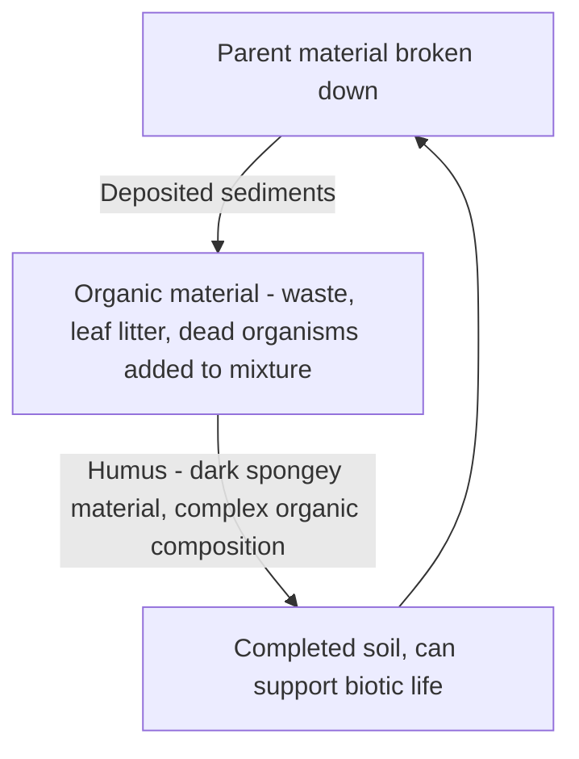

Soil is a complex mixture of:
- Minerals
- Organic particles
- Air
- Water
- Microorganisms
- Decaying organisms

Derived from deposition of weathered and eroded rock

**Parent material** - base rock for soil

Factors that influence soil formation:
- Climate
- Organisms
- Topography
- Parent material
- Time

Soil formation flowchart

> Soil with a lot of humus is ideal for plant life as it holds lots of moisture

Topsoil - renewable resource (see [[Types of Resources]])

Can take many years to create a little amount of topsoil

Soil can be eroded by wind or water, but soil can also filter water that moves through it