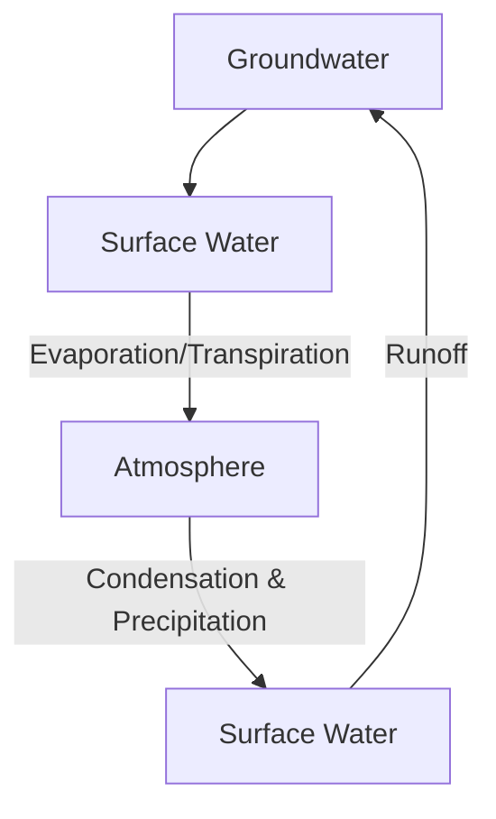

Water cycle includes **evaporation/transpiration, condensation, precipitation**

Moves between ocean, land, and living organisms, with ocean as main reservoir.

1. Surface water heated by sun and evaporated into atmosphere

> Evaporation: liquid water turns into gas
> **Transpiration:** Water is evaporated directly from plants

2. Water molecules stay in the atmosphere ~2 weeks

> Cooled water vapor condenses and forms clouds

3. Condensed water eventually falls to Earth as precipitation

**Runoff** occurs when excess preservation builds up on a surface and flows into a waterway

> Effect can be increased by non-porous/non-absorptive man-made materials (concrete, etc.)

It can take ~4000 years for a water molecule to complete a full cycle (groundwater travels **extremely slowly**)

However, disregarding groundwater, the cycle is relatively quick (liquid and gaseous water travels relatively quickly)

![[Pasted image 20221010221420.png]]
