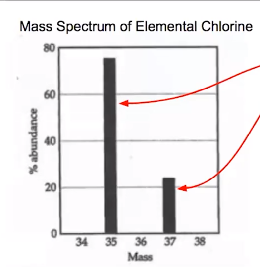

# Mass Spectroscopy

What is **mass spectroscopy**?
-   Where does the atomic mass come from?
-   Used to identify the different isotopes of elements and figure out average atomic mass
-   Example: Mass spectrum of Cl

{width="3.6354166666666665in" height="3.75in"}
-   This means that ~80% of all particles of chlorine weigh 35 amu and ~20% of all particles of chlorine weigh 37%

    -   Height: relative abundance

    -   X axis: each isotope and its mass number
-   Therefore, the average atomic mass is somewhere in between

```{=html}
<!-- -->
```
-   To find average atomic mass: multiply each isotope by its relative abundance and add them all

    -   **Weighted Average**

