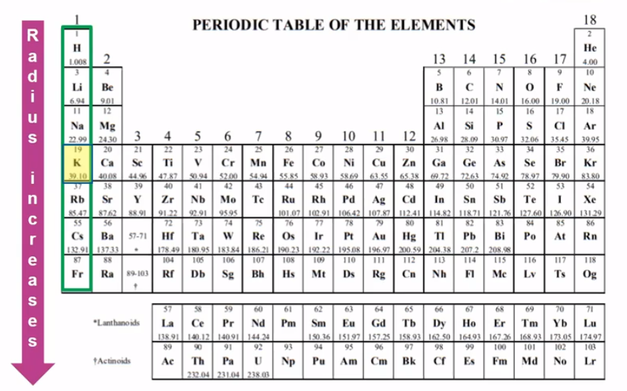
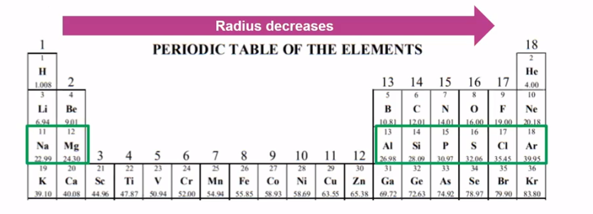
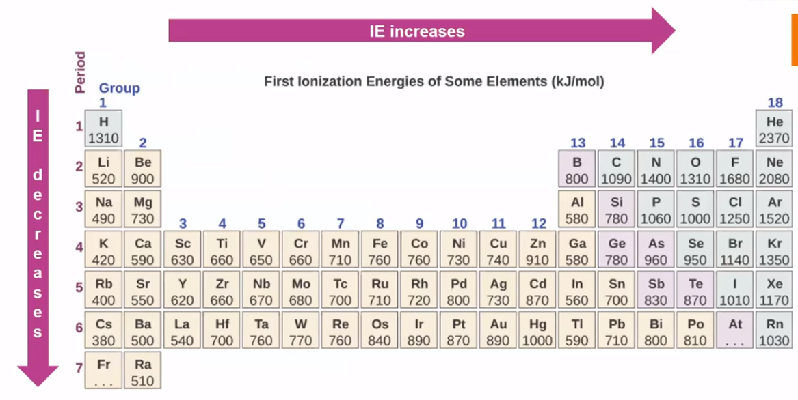
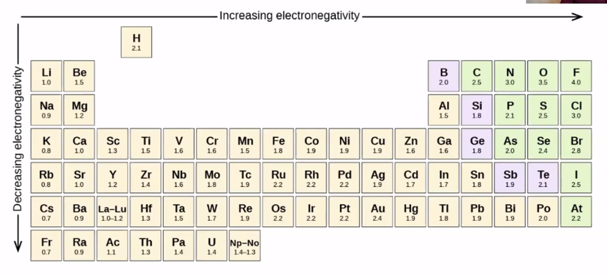
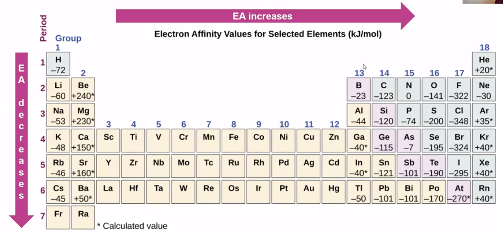

# Periodic Trends
-   Three rules

    -   Electrons are attracted to the protons in the nucleus of an atom

    -   Electrons are repelled by other electrons in an atom

    -   Completed shells are very stable and desirable
-   Atomic Radii

    -   Cations are smaller than atoms

    -   Anions are larger than atoms

    -   Measured in pM

    -   More shells = larger

    -   More valence electrons = smaller (valence electrons are held more tightly to nucleus because more protons)

{width="6.125in" height="3.8229166666666665in"}


{width="6.208333333333333in" height="2.2395833333333335in"}
-   Ionization Energy

    -   Energy required to remove an electron from an atom

    -   Tied to atomic radius

    -   **Larger atomic radii =>**

        -   Weaker attraction between valence electrons and nucleus, therefore

        -   Smaller ionization energy

{width="7.03125in" height="3.53125in"}
-   Electronegativity

    -   The ability of an atom in a molecule to attract shared electrons to itself:

        -   {width="0.90625in" height="0.5in"}

    -   Also tied to atomic radius

    -   **Larger atomic radii =>**

        -   Weaker attraction because of greater distance between nucleus of atom and electrons of another

        -   Smaller electronegativity

{width="8.854166666666666in" height="4.020833333333333in"}
-   Noble gases are excluded (don't share electrons with others)

```{=html}
<!-- -->
```
-   Electron affinity

    -   Change in energy when an atoms gains an electron and forms an ion

    -   Can be endothermic (gains energy) or exothermic (loses energy)

    -   **Metals**

        -   Easier to lose electrons

            -   Nucleus doesn't have a strong attraction to valence electrons

            -   Therefore, adding an electron is endothermic or only slightly exothermic

            -   Electron affinity is positive of slightly negative

    -   **Nonmetals**

        -   Easier to gain electrons because nucleus has a stronger attraction to valence electrons

            -   Adding electrons is exothermic

            -   Electron affinity is negative

{width="8.65625in" height="4.083333333333333in"}


