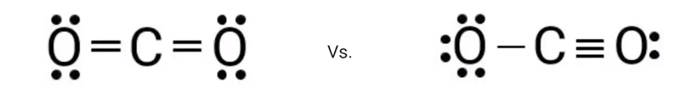
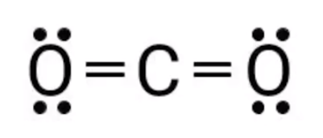

# Formal Charge
-   What if a molecule can have multiple **valid** Lewis diagrams?

    -   Example: Carbon dioxide

{width="7.895833333333333in" height="1.1666666666666667in"}
-   How to tell which one is correct?

    -   The more **dominant** (common) structure

```{=html}
<!-- -->
```
-   What is formal charge?

    -   The hypothetical charge of an atom in a Lewis structure if, hypothetically, all atoms had the same electronegativity

    -   To calculate the formal charge, electrons should first be assigned to each atom on the diagram

        -   An **unshared (free)** electron (dots) is fully assigned to the atom it belongs to

        -   An atom gets **half** of the atom it shares in bonds

    -   {width="2.78125in" height="1.1875in"}

        -   The oxygen atoms get 4 + (4 / 2) = 6 electrons each

        -   The carbon atom gets 8 / 2 = 4 electrons

    -   Then, the number of assigned electrons gets subtracted from the number of valence electrons of that atom

        -   Oxygen: 6 - 6 = 0, formal charge = 0

        -   Carbon: 4 - 4 = 0, formal charge = 0

```{=html}
<!-- -->
```
-   **The dominant Lewis structure is the one with:**

    -   The minimum number of nonzero formal charges

    -   If nonzero formal charges remain, the negative charge should be assigned to the **most electronegative atom**

        -   The most electronegative atom will attract electrons more, so it takes the negative charge

    -   The sum of all formal charges in the molecule should add to the charge of the chemical species (0 if neutral, +1 for NH4^+^...)


