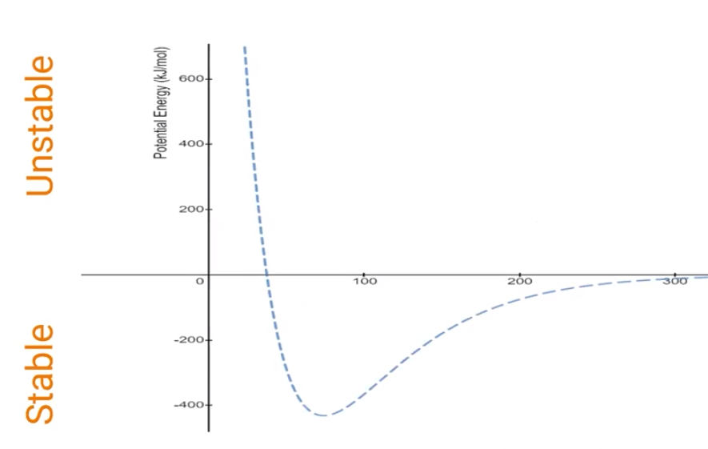
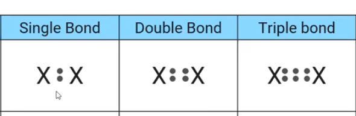
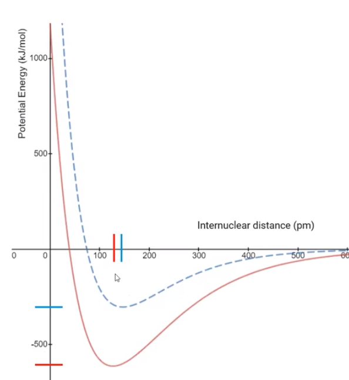
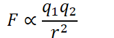

# Intramolecular Forces and Potential Energy
-   Chemical bonds have a balance between attractive (+ proton and - electron) and repulsive ( - electron and - electron) forces
-   Potential energy curve

{width="6.145833333333333in" height="3.8854166666666665in"}
-   X axis: distance between two nuclei
-   Y axis: potential energy (kJ/mol)

    -   > 0: Unstable atom arrangement

        -   If they are too close together, the repulsive forces make the bond unstable (the sharp hill on the right)

        -   If they are too far apart, they do not have enough attraction (on the left)

    -   < 0: stable atom arrangement

        -   The bond is the most stable (strongest) at a distance where repulsion is minimized and attraction is maximized (the valley in the middle)

    -   Y axis is the **energy of bond formation**

        -   Therefore, stable arrangements will **release energy** (energy is negative)

        -   Unstable arrangements will take energy to create (energy positive)

            -   Think of shoving two repulsive magnets together

```{=html}
<!-- -->
```
-   Bond order, bond length, bond strength

    -   {width="4.09375in" height="1.3333333333333333in"}

    -   **Single Bond**

        -   Shares fewest number of electrons (2)

        -   Weaker attraction between nucleus of one atom and bonding electrons

        -   Weaker and longer

    -   **Double Bond**

        -   Shares medium number of electrons (4)

    -   **Triple Bond**

        -   Shares the most electrons

        -   Stronger attraction between nucleus of one atoms and bonding electrons

        -   Shorter and stronger

    -   Example: potential energy diagram of single (blue) and double (red) bonds

{width="4.125in" height="4.46875in"}
-   Double bond is stronger (more energy)
-   And closer together (internuclear distance is smaller)

```{=html}
<!-- -->
```
-   **Ionic bonds and Coulomb's law**

    -   Electrostatic between a positively charged cation and a negatively charged anion

    -   Can be explained with Coulomb's Law:

        -   {width="1.7291666666666667in" height="0.5833333333333334in"}

        -   Larger ion charge => larger force of attraction

        -   Greater distance between ion => smaller force of attraction


