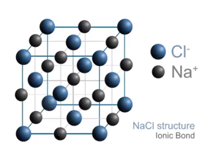

# Structure of Ionic Solids
-   Ionic compound

    -   Electrostatic attraction between positively charged cation and negatively charged anion

{width="2.4583333333333335in" height="2.2916666666666665in"}
-   Or

{width="3.0in" height="2.3020833333333335in"}
-   Note that:

    -   **Size is represented** (Cl is larger, Na is smaller)

        -   Size is important in these diagrams

    -   These are **not** individual molecules

    -   **Charges** are shown and alternating

```{=html}
<!-- -->
```
-   Ionic compounds and conductance

    -   A substance must have **charged particles** that are **free to move** in order to conduct electricity

    -   A **solid ionic compound** will therefore **not** conduct electricity

        -   Particles are charged but not free to move

{width="2.0729166666666665in" height="1.5416666666666667in"}
-   However, a **molten** ionic compound will conduct electricity

    -   Particles are charged and free to move

{width="2.3854166666666665in" height="2.0in"}


