# VSEPR
-   Lewis Diagrams do not tell the entire story of molecular geometry
-   To tell the geometry of molecules, use VSEPR

    -   Valence Shell Electron Pair Repulsion

    -   Valence electrons will repel each other and create a certain 3D geometry that maximizes space in between
-   Molecular geometry

    -   Geometry of molecules will depend on the **number of electron domains** around the central atom

        -   Sometimes called the **steric** number

        -   Single, double, and triple bonds all count as one bond

        -   Each 3D shape will have its own name

        -   Lone pairs occupy a bit more space than bonds
-   VSEPR numbers are assigned here as:

    -   Bonds / Lone pairs / Electron Domains
-   Two electron domains:

    -   **Linear (2 / 0 / 2)**

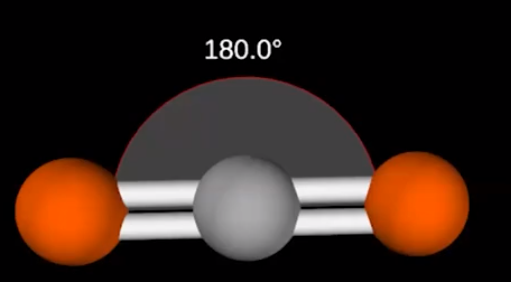{width="3.5416666666666665in" height="1.9583333333333333in"}
-   180 degrees
-   Three electron domains:

    -   **Trigonal Planar (3 / 0 / 3)**

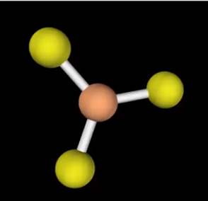{width="2.0416666666666665in" height="1.96875in"}
-   120 degrees

```{=html}
<!-- -->
```
-   **Bent (2 / 1 / 3)**

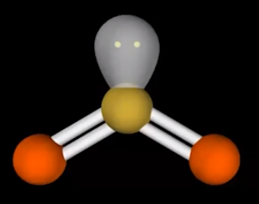{width="2.2083333333333335in" height="1.7395833333333333in"}
-   119 degrees

    -   Lone pairs occupy a bit more space than bonds

```{=html}
<!-- -->
```
-   Four electron domains

    -   **Tetrahedral (4 / 0 / 4)**

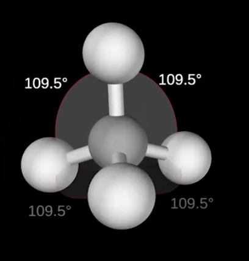{width="2.8229166666666665in" height="2.96875in"}
-   109.4 degrees

```{=html}
<!-- -->
```
-   **Trigonal pyramidal (3 / 1 / 4)**

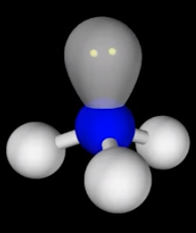{width="1.5208333333333333in" height="1.8125in"}
-   Slightly < 109.5 degrees

```{=html}
<!-- -->
```
-   **Bent (2 / 2 / 4)**

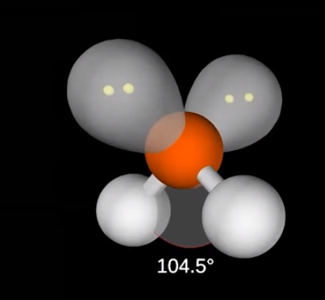{width="2.7916666666666665in" height="2.5729166666666665in"}
-   104.5 degrees

    -   Lone pairs push slightly harder

```{=html}
<!-- -->
```
-   Five electron domains:

    -   **Trigonal Bi-pyramidal (5 / 0 / 5)**

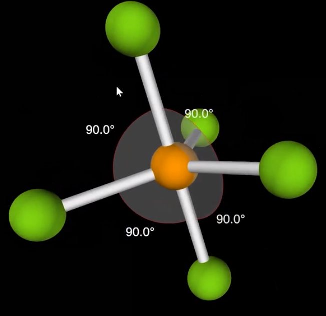{width="2.59375in" height="2.5208333333333335in"}
-   Like trigonal planar with 2 extra atoms on top and bottom
-   90 and 120 degrees

```{=html}
<!-- -->
```
-   **Seesaw (4 / 1 / 5)**

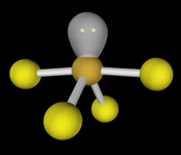{width="2.65625in" height="2.2708333333333335in"}
-   **T- shaped (3 / 2 / 5)**

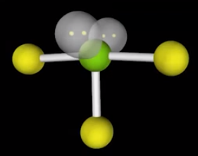{width="1.9479166666666667in" height="1.53125in"}
-   **Linear (2 / 3 / 5)**

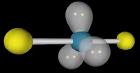{width="1.9791666666666667in" height="1.03125in"}
-   Six electron domains

    -   **Octahedral (6 / 0 / 6)**

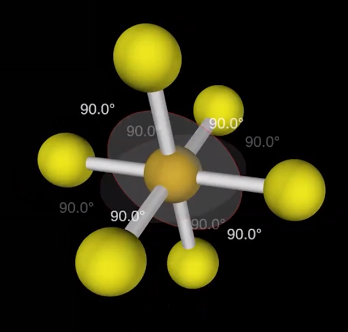{width="2.6458333333333335in" height="2.5208333333333335in"}
-   **Square Pyramidal (5 / 1 / 6)**

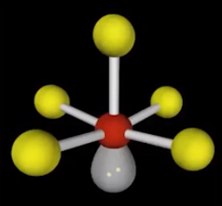{width="2.2604166666666665in" height="2.1875in"}
-   **Square Planar (4 / 2 / 6)**

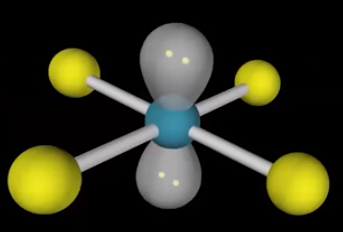{width="2.375in" height="1.6041666666666667in"}


