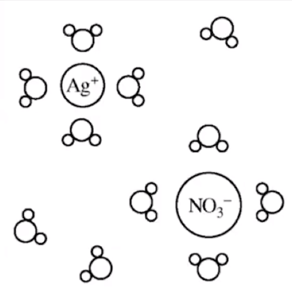

# Representations of solutions

Particulate Representations--

Communicate structure and properties of solutions
-   Ion sizes
-   Orientation of solute ions and solvent particles (depends on polarity etc)
-   Concentration of components
-   Anions larger than cations
-   Show interactions among components

{width="3.4583333333333335in" height="3.46875in"}

